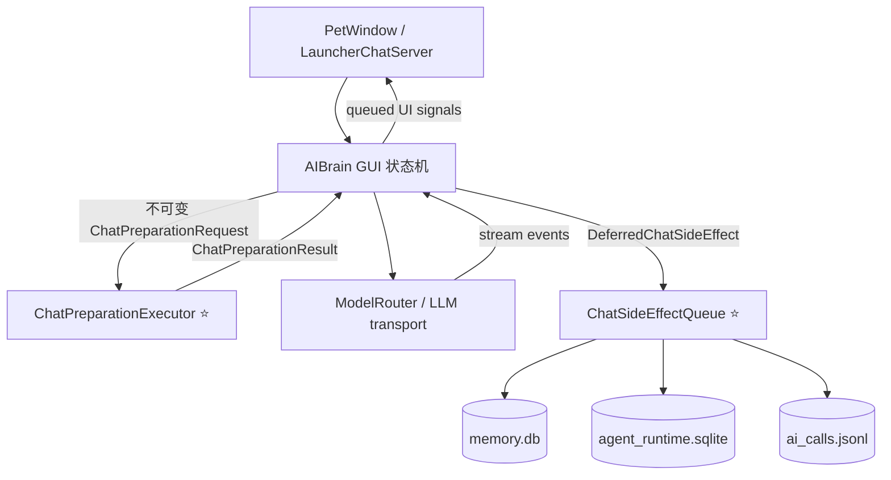
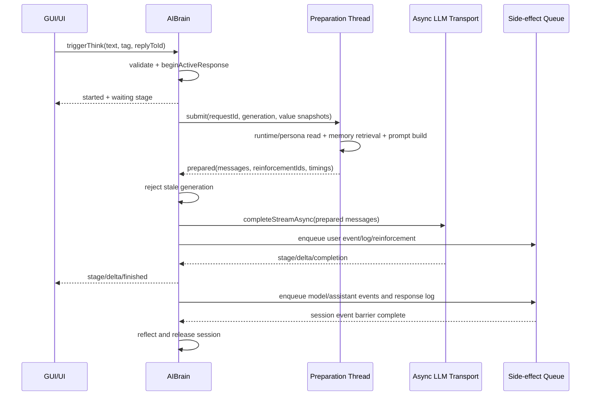
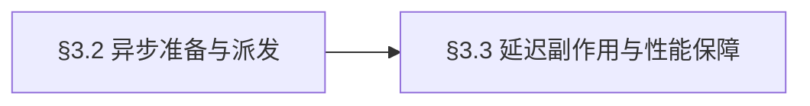

# 聊天发送异步流水线桌面端技术设计

## 文档修订历史

| 版本 | 时间 | 修订人 | 说明 |
|------|------|--------|------|
| 1.0 | 2026-09-02 | Codex | 首版，确定集中式异步准备与延迟副作用方案 |

## 涉及仓库

| 仓库ID | 路径 | 类型 | 本次变更摘要 |
|--------|------|------|--------------|
| DesktopPet | `/Users/huang/Desktop/DesktopPet` | Qt/C++ 桌面应用 | 消除聊天发送阶段对 GUI/渲染事件循环的同步阻塞 |

## 1. 背景和目标

当前 `RenderViewport` 依赖 GUI 线程中的 `QTimer` 驱动重绘，而屏幕聊天和 Launcher 聊天最终都会在同一线程直接调用 `AIBrain::triggerThink`。该方法在 `QNetworkAccessManager::post` 之前同步完成运行时快照、事件写入、记忆召回及强化、上下文构建和调用日志写盘，造成消息提交后的短暂停帧。

本次采用集中式分阶段异步流水线，不迁移完整 Agent Actor。目标是保持既有回复状态机、工具轮次和流式协议不变，将发送入口的 GUI 同步工作限制为轻量状态更新与任务投递，并将不影响模型请求正确性的副作用移出网络派发关键路径。

术语：

- **准备任务**：从用户输入及只读运行时快照生成首轮 `QList<ChatMessage>` 的任务。
- **副作用任务**：事件、记忆强化、调用日志等不产生模型请求正文的持久化操作。
- **generation 门禁**：使用 `m_requestGeneration` 判定异步结果是否仍属于当前回复。
- **网络派发点**：调用 `ModelRouter::completeStreamAsync` 并获得 `LlmRequestHandle` 的时刻。

澄清结论：

- [2026-09-02] 当前不迁移完整 Agent Actor；新接口按不可变消息边界设计，保留未来迁移能力。
- [2026-09-02] 非关键持久化不得增加网络派发关键路径时长。
- [2026-09-02] macOS 本地不运行 ONNX，不启动依赖缺失 3D 模型资源的完整桌宠。

### 1.1 全局并发约束

- 影响 §3.2、§3.3：GUI 线程只修改 `AIBrain`、`PetWindow`、聊天模型和渲染对象的可变状态；后台线程不得保存这些对象的裸指针或引用。
- 影响 §3.2、§3.3：所有跨线程载荷均为值对象，至少包含 `requestId` 和 `generation`；回调先验证 generation、活动消息 ID 和终止状态。
- 影响 §3.2、§3.3：`QSqlDatabase` 连接只在创建它的线程使用。后台执行器必须在自己的线程创建、打开和关闭独立连接，禁止复用 `MemoryStore::databaseConnectionName()` 或运行时主连接。
- 影响 §3.2、§3.3：同一回复只允许一个准备任务进入网络派发；取消、停止、运行时重配和析构都会使旧 generation 失效。
- 影响 §3.3：副作用按提交顺序串行执行；用户事件必须先于同 session 的模型及 assistant 事件，完成反思只能在相关事件已提交后触发。
- 影响 §3.2、§3.3：关闭顺序固定为停止接收任务、使 generation 失效、取消网络、等待或丢弃后台结果、关闭后台数据库连接、销毁执行器。

### 1.2 全局性能与降级约束

- 影响 §3.2：发送入口在一帧 16ms 内发布用户消息和 pending assistant 状态；GUI 上单段聊天逻辑目标不超过 4ms。
- 影响 §3.2：本地准备至网络派发 P95 目标不超过 50ms；后台调度开销不得通过主动 sleep 或轮询引入。
- 影响 §3.2：准备执行器不可用、初始化失败或任务异常时，当前请求以 `Failed` 结束并恢复 `m_busy`，不得回退为 GUI 线程同步准备。
- 影响 §3.3：调用日志、记忆强化或遥测失败采用降级策略，不得使已可发送的模型请求失败。
- 影响 §3.2：当前生产路径未注入 EmbeddingIndex；本次执行器不加载 ONNX。未来接入 embedding 时必须作为执行器内部的可取消 CPU 任务，不能回到 GUI 线程。

## 2. 总体设计

### 2.1 系统架构



### 2.2 消息发送流程



### 2.3 代码变更清单

| 变更类型 | 模块/类 | 摘要 |
|----------|---------|------|
| 🆕 | `core/ai/chat/chat_preparation_types.h` | 跨线程不可变请求、结果、耗时和值快照 |
| 🆕 | `core/ai/chat/chat_preparation_executor.*` | 单线程准备执行器及线程内 SQLite 读连接 |
| 🔧 | `core/ai/ai_brain.*` | 将 `triggerThink` 拆成投递与异步续接，增加 generation 门禁 |
| 🔧 | `core/ai/ai_brain_router.cpp` | 将上下文构建调整为可由准备执行器调用的纯值路径 |
| 🔧 | `core/ai/memory/memory_retriever.*` | 分离只读召回结果与记忆强化写入 |
| 🆕 | `core/ai/chat/chat_side_effect_queue.*` | 串行执行事件、记忆强化和 JSONL 日志写入 |
| 🔧 | `core/ai/runtime/agent_runtime_services.*` | 暴露线程安全的准备环境值并支持异步事件屏障 |
| 🔧 | `core/ai/ai_call_logger.*` | 提供可在线程内执行的值对象日志写入接口 |
| 🔧 | `tests/test_streaming_dialogue.cpp` | 异步生命周期、取消和网络派发测试 |
| 🆕 | `tests/test_chat_preparation_executor.cpp` | 准备执行器与线程归属测试 |
| 🔧 | `tests/test_memory_strategy.cpp` | 只读召回不落盘、延迟强化测试 |
| 🔧 | `CMakeLists.txt` | 新源码和测试目标 |
| 🔧 | `README.md` | 当前方案、性能边界与升级 Agent Actor 的触发条件 |

## 3. 详细设计

### 3.1 模块概览

| 编号 | 名称 | 核心职责 | 主要功能 |
|------|------|----------|----------|
| 3.2 | 异步聊天准备与模型派发 | 将发送前重任务移出 GUI 线程 | 值快照、后台准备、generation 门禁、模型派发 |
| 3.3 | 延迟副作用与性能保障 | 将非关键持久化移出请求关键路径 | 有序事件、记忆强化、日志、耗时指标、README |



### 3.2 异步聊天准备与模型派发

#### 1. 模块定位

该模块是 GUI 聊天入口与现有 `ModelRouter` 之间的异步准备边界，负责在不共享可变 Qt/SQLite 对象的前提下生成首轮模型消息，并将有效结果续接回现有流式状态机。

核心领域对象：

| 对象 | 职责 |
|------|------|
| `ChatPreparationEnvironment` | 初始化后台线程独有的数据库路径、profile 和提示词配置 |
| `ChatPreparationRequest` | 保存单次请求的不可变输入、会话标识和 generation |
| `ChatPreparationResult` | 返回模型消息、待强化记忆 ID、阶段耗时或受控错误 |
| `ChatPreparationExecutor` | 管理专用线程、顺序执行准备任务并把结果排回对象所属线程 |

#### 2. 核心服务接口

```cpp
struct ChatPreparationEnvironment {
    QString profileId;
    QString runtimeDatabasePath;
    QString memoryDatabasePath;
    IdentityBaseline identityBaseline;
    PersonalityPolicy personalityPolicy;
    PromptTemplate promptTemplate;
};

struct ChatPreparationRequest {
    QString requestId;
    quint64 generation = 0;
    QString sessionId;
    QString reason;
    QString triggerTag;
    QString petName;
    QStringList allowedActions;
    QList<ChatMessage> conversationMemory;
    QList<WorkingMemoryItem> workingMemory;
    QList<SkillEntry> skills;
    std::optional<EmotionSnapshot> emotion;
};

struct ChatPreparationResult {
    QString requestId;
    quint64 generation = 0;
    QString sessionId;
    QList<ChatMessage> messages;
    QStringList reinforcementIds;
    qint64 preparationDurationMs = 0;
    DomainError error;
};

class ChatPreparationExecutor : public QObject {
    Q_OBJECT
public:
    Result<void, DomainError> start(const ChatPreparationEnvironment& environment);
    void submit(ChatPreparationRequest request);
    void stop();
signals:
    void prepared(ChatPreparationResult result);
};

void AIBrain::continuePreparedThink(ChatPreparationResult result);
```

`ChatPreparationExecutor::start` 入参：

| 字段名 | 类型 | 值来源 | 说明 |
|--------|------|--------|------|
| `environment.profileId` | `QString` | 调用方传入 | 当前已解析 profile |
| `environment.runtimeDatabasePath` | `QString` | 系统推导（来源: `AgentRuntimeServices` 当前 profile 数据目录） | 后台身份读取连接 |
| `environment.memoryDatabasePath` | `QString` | 系统推导（来源: `MemoryStore::databasePath()`） | 后台记忆读取连接 |
| `environment.identityBaseline` | `IdentityBaseline` | 调用方传入 | 按值复制，不跨线程读原服务 |
| `environment.personalityPolicy` | `PersonalityPolicy` | 调用方传入 | 按值复制 |
| `environment.promptTemplate` | `PromptTemplate` | 调用方传入 | 与主运行时一致的提示词模板 |

`ChatPreparationExecutor::submit` 入参：

| 字段名 | 类型 | 值来源 | 说明 |
|--------|------|--------|------|
| `requestId` | `QString` | 系统推导（来源: `QUuid::createUuid`） | 准备任务稳定标识 |
| `generation` | `quint64` | 系统推导（来源: `AIBrain::m_requestGeneration`） | 迟到结果门禁 |
| `sessionId` | `QString` | 系统推导（来源: `AgentSession::create`） | 运行时事件关联 |
| `reason` | `QString` | 调用方传入 | 用户文本或触发原因 |
| `triggerTag` | `QString` | 调用方传入 | 路由与记忆策略标签 |
| `petName` | `QString` | 系统推导（来源: `AIBrain::m_petName`） | persona 与统计维度 |
| `allowedActions` | `QStringList` | 系统推导（来源: `allowedActionsForTrigger`） | 工具约束上下文 |
| `conversationMemory` | `QList<ChatMessage>` | 系统推导（来源: `AIBrain::m_memory` 值复制） | 自然对话历史快照 |
| `workingMemory` | `QList<WorkingMemoryItem>` | 系统推导（来源: `WorkingMemoryCache::all` 值复制） | 临时记忆快照 |
| `skills` | `QList<SkillEntry>` | 系统推导（来源: `SkillStore::all` 值复制） | 技能匹配快照 |
| `emotion` | `optional<EmotionSnapshot>` | 系统推导（来源: `currentEmotionSnapshot`） | 不跨线程调用 provider |

`continuePreparedThink` 入参：

| 字段名 | 类型 | 值来源 | 说明 |
|--------|------|--------|------|
| `result` | `ChatPreparationResult` | 系统推导（来源: `ChatPreparationExecutor::prepared`） | 只在对象所属线程处理 |

#### 3. 模块业务流程

1. `triggerThink` 在 GUI 线程完成状态校验、取消睡眠、设置 `m_busy`、创建 active response 和 session ID，并立即发出 started/stage 信号。
2. 它创建 `requestId + generation`，按值复制短生命周期输入，随后调用 `submit` 返回事件循环；不得构建 prompt、查询 SQLite 或写文件。
3. 执行器在线程内按需创建独立 `SqliteIdentityRepository` 和 `SQLiteMemoryRepository` 连接，获取 persona 版本与记忆条目；数据库不可用时保留基础 persona/无持久记忆的降级路径。
4. 执行器调用只读召回逻辑，生成 memory hints 与 reinforcement IDs；召回阶段不得更新任何数据库记录。
5. 执行器用独立 `ContextBuilder` 和值快照生成 system/runtime context，追加技能提示，返回 `ChatPreparationResult`。
6. `continuePreparedThink` 先验证 requestId、generation、active message 和 terminal 状态；不匹配则静默丢弃。
7. 有效结果调用现有 `thinkInternal`，由 `ModelRouter::completeStreamAsync` 发起网络请求；空消息或准备错误通过 `finishActiveResponse(Failed)` 收口。
8. 本地 router 命中保持原同步快速路径；只有需要模型上下文的请求进入准备执行器。

#### 4. 数据变更

N/A — 本模块不涉及数据写入。后台数据库连接仅执行读取，记忆强化和事件写入统一由 §3.3 处理。

#### 5. 实现锚点

| 调用 | 来源 | 完整签名 | 参数来源 |
|------|------|----------|----------|
| 聊天入口 | `core/ai/ai_brain.h` | `void triggerThink(const QString& reason, const QString& triggerTag, const QString& replyToId)` | UI/Launcher 传入文本、标签和消息 ID |
| 模型派发 | `core/ai/model/model_router.h` | `std::shared_ptr<LlmRequestHandle> completeStreamAsync(const ModelRequest&, LlmStreamObserver, ModelCompletionHandler)` | 准备结果、既有 observer/completion |
| 记忆数据路径 | `core/ai/memory/memory_store.h` | `const QString& databasePath() const` | 初始化环境值 |
| 工作记忆快照 | `core/ai/memory/working_memory_cache.h` | `QList<WorkingMemoryItem> all() const` | 提交任务前值复制 |

| 参照位置 | 复用要点 |
|----------|----------|
| `ui/chat_conversation_model.cpp` 的单线程 `QThreadPool` | 后台任务完成后使用 queued invocation 回对象线程 |
| `AIBrain::m_requestGeneration` 与 `thinkInternal` 的 `isCurrent` | 保持取消和迟到回调语义一致 |
| `AIBrain::buildBaseMessages` | 保持 persona、历史、memory hints、技能提示的内容顺序 |

#### 6. 异常场景

| 场景 | 类型 | 处理策略 | 与全局约束关系 |
|------|------|----------|----------------|
| 请求已 busy、AI 未启用或 storage 未初始化 | 业务异常 | 抛：沿用 `thinkRequestRejected` 可见拒绝 | 使用 §1.1 单回复约束 |
| 准备结果 generation 已失效 | 业务异常 | 兜底值：静默丢弃，不改变当前状态 | 使用 §1.1 generation 门禁 |
| 后台身份库读取失败 | 系统异常 | 降级：使用 baseline persona，继续准备 | 使用 §1.2 降级约束 |
| 后台记忆库读取失败 | 系统异常 | 降级：不注入持久记忆，继续准备 | 使用 §1.2 降级约束 |
| 执行器未启动、线程退出或结果为空 | 系统异常 | 抛：结束当前 assistant 为 Failed 并恢复 busy | 需要本模块特殊收口，无 FacadeExceptionAspect |
| stop/析构发生在任务执行中 | 系统异常 | 兜底值：generation 失效，结果不再触达状态机 | 使用 §1.1 关闭顺序 |

#### 7. 关键行为场景

- 正常用户消息进入 `triggerThink` 后，用户消息和 pending assistant 在一个 GUI 事件轮次内可见；后台准备成功后仅派发一次模型请求，聊天历史无额外记录。
- 包含可召回记忆和匹配技能的消息完成准备后，生成消息顺序与当前 `buildBaseMessages` 一致，且记忆数据库的 access count 在准备阶段保持不变。
- 用户在准备未完成时停止生成，迟到结果被 generation 门禁丢弃，不创建网络请求，assistant 最终状态保持 Stopped。
- 身份数据库不可读但基础配置有效时，准备使用 baseline persona 继续派发；记忆数据库不可读时不注入 memory hints。
- 执行器启动失败时，用户收到单次失败生命周期，`m_busy` 恢复为 false，不在 GUI 线程执行同步兜底准备。

### 3.3 延迟副作用与性能保障

> 依赖：§3.2 的 `requestId`、`generation`、`ChatPreparationResult::reinforcementIds` 和网络派发边界。

#### 1. 模块定位

该模块是聊天生命周期的有序后台持久化出口，负责在不阻塞网络派发和 GUI 渲染的前提下提交运行时事件、记忆强化与 AI 调用日志，并提供性能回归观测和未来 Actor 迁移说明。

核心对象：

| 对象 | 职责 |
|------|------|
| `DeferredChatSideEffect` | 描述事件、强化或日志任务的值载荷 |
| `ChatSideEffectQueue` | 在专用单线程中按提交顺序执行副作用并发布屏障结果 |
| `ChatPreparationTimings` | 记录 enqueue、prepare、dispatch 等单调时钟耗时 |

#### 2. 核心服务接口

```cpp
enum class ChatSideEffectType {
    RuntimeEvent,
    MemoryReinforcement,
    RequestLog,
    ResponseLog,
    Barrier
};

struct DeferredChatSideEffect {
    ChatSideEffectType type;
    QString requestId;
    quint64 generation = 0;
    QString sessionId;
    EventDraft event;
    QList<MemoryEntry> reinforcedEntries;
    QJsonObject logRecord;
};

class ChatSideEffectQueue : public QObject {
    Q_OBJECT
public:
    Result<void, DomainError> start(const ChatSideEffectEnvironment& environment);
    void enqueue(DeferredChatSideEffect effect);
    void enqueueBarrier(QString sessionId, quint64 generation);
    void stop(bool drainAcceptedWork);
signals:
    void barrierCommitted(QString sessionId, quint64 generation);
    void persistenceWarning(QString safeMessage);
};

MemoryReinforcementBatch MemoryStore::stageReinforcement(
    const QStringList& ids,
    const QDateTime& accessedAt = QDateTime::currentDateTimeUtc());
```

`ChatSideEffectQueue::start` 入参：

| 字段名 | 类型 | 值来源 | 说明 |
|--------|------|--------|------|
| `profileId` | `QString` | 调用方传入 | 事件归属 profile |
| `runtimeDatabasePath` | `QString` | 系统推导（来源: 当前 profile 数据目录） | 线程内 EventRepository 连接 |
| `memoryDatabasePath` | `QString` | 系统推导（来源: `MemoryStore::databasePath`） | 线程内 MemoryRepository 连接 |
| `aiCallLogPath` | `QString` | 配置默认值（来源: `AiCallLogger` 当前路径） | JSONL 输出路径 |

`ChatSideEffectQueue::enqueue` 入参：

| 字段名 | 类型 | 值来源 | 说明 |
|--------|------|--------|------|
| `effect.type` | `ChatSideEffectType` | 系统推导（来源: 调用阶段） | 决定执行分支 |
| `effect.requestId` | `QString` | 系统推导（来源: 当前准备请求） | 诊断关联 |
| `effect.generation` | `quint64` | 系统推导（来源: 当前 AIBrain generation） | 回调门禁 |
| `effect.sessionId` | `QString` | 系统推导（来源: 当前 AgentSession） | 事件顺序与屏障 |
| `effect.event` | `EventDraft` | 系统推导（来源: 原 `appendRuntimeEvent` 参数） | RuntimeEvent 时使用 |
| `effect.reinforcedEntries` | `QList<MemoryEntry>` | 系统推导（来源: `stageReinforcement`） | MemoryReinforcement 时使用 |
| `effect.logRecord` | `QJsonObject` | 系统推导（来源: `AiCallLogger` 结构化记录） | 日志任务时使用 |

`MemoryStore::stageReinforcement` 入参：

| 字段名 | 类型 | 值来源 | 说明 |
|--------|------|--------|------|
| `ids` | `QStringList` | 系统推导（来源: `ChatPreparationResult::reinforcementIds`） | 去重后更新内存副本 |
| `accessedAt` | `QDateTime` | 配置默认值（来源: 当前 UTC 时间） | 同批次统一时间 |

#### 3. 模块业务流程

1. 准备任务被接受时，AIBrain 构建 `UserMessageReceived` 值对象并入队；网络派发不等待其提交。
2. 准备结果返回后，AIBrain 调用 `stageReinforcement` 仅更新 GUI 线程拥有的 `MemoryStore` 内存副本并得到持久化副本，再将批次入队。
3. `thinkInternal` 将 request log 转为 `QJsonObject` 入队，然后立即调用模型路由；日志文件打开、序列化和写入均在副作用线程完成。
4. 模型完成后，`ModelCallCompleted`、可选 `AssistantResponseProduced`、response log 与 session barrier 按该顺序入队。
5. 副作用线程使用自己创建的 repository 连接串行提交；单个任务失败只发脱敏 warning，队列继续处理后续任务。
6. barrier 只有在其之前已接受的任务均处理后才发出 `barrierCommitted`。AIBrain 验证 generation 后调用 `reflectOnCompletedSession` 并释放 session；失败回复不生成 assistant produced 事件，但同样通过 barrier 释放 session。
7. stop 正常退出时停止接收新任务并 drain 已接受任务；强制销毁或初始化失败允许丢弃未开始的非关键日志，但不得执行跨线程回调访问已销毁对象。
8. 记录 `uiAcknowledgeMs`、`preparationMs`、`dispatchLagMs` 和 queue depth。README 说明当前架构与升级完整 Agent Actor 的量化触发条件。

#### 4. 数据变更

不新增表或字段。

| 数据 | 写入语义 | 值来源 | 事务边界 |
|------|----------|--------|----------|
| `event_log` | 既有 INSERT | `DeferredChatSideEffect::event` | 每个事件沿用既有单事件事务；队列顺序保证 session 时序 |
| `memories` 及子表 | 既有 UPDATE | `stageReinforcement` 返回的完整条目 | 同一 reinforcement batch 一个事务 |
| `log/ai_calls.jsonl` | append line | `logRecord` | 单条日志一次打开、追加和关闭 |

#### 5. 实现锚点

| 调用 | 来源 | 完整签名 | 参数来源 |
|------|------|----------|----------|
| 现有事件追加 | `core/ai/event/event_ledger.h` | `Result<EventRecord, DomainError> append(const EventDraft& draft)` | 副作用线程内 ledger 与值对象 draft |
| 现有批量强化 | `core/ai/memory/memory_store.h` | `bool reinforceEntries(const QStringList& ids)` | 改为内存 stage + worker repository update |
| 现有请求日志 | `core/ai/ai_call_logger.h` | `void logRequest(const QString&, const QString&, const QString&, const QString&, int, const QList<ChatMessage>&, const QJsonArray&)` | 拆为值对象构建和后台 append |
| 会话反思 | `core/ai/runtime/agent_runtime_services.h` | `void reflectOnCompletedSession(const QString& sessionId)` | 仅在 barrier committed 后调用 |

| 参照位置 | 复用要点 |
|----------|----------|
| `ChatConversationModel::appendToStore` | 单线程后台持久化、QPointer 和 queued warning 模式 |
| `MemoryStore::reinforceEntries` | 保留同批次去重、统一时间和事务回滚语义 |
| `SqliteEventLedger::append` | 保留 schema 校验、profile 校验和事件 ID 生成 |

| 字段 | 实际格式 | 易错点 |
|------|----------|--------|
| `DeferredChatSideEffect::logRecord` | 与现有 `ai_calls.jsonl` 每行对象完全一致 | 不得改变现有字段名或记录敏感 transport blocks |
| `EventDraft::payload` | 既有 event schema 对应的 JSON 对象 | 后台线程仍须经过 `EventSchemaRegistry` 校验 |

#### 6. 异常场景

| 场景 | 类型 | 处理策略 | 与全局约束关系 |
|------|------|----------|----------------|
| 同 session 事件提交次序错误 | 业务异常 | 抛：测试和 debug 断言拒绝越过 barrier | 使用 §1.1 有序约束 |
| generation 已失效后收到 barrier | 业务异常 | 兜底值：只清理后台资源，不触发当前回复逻辑 | 使用 §1.1 门禁 |
| 记忆强化条目已被删除 | 业务异常 | 降级：跳过该条，其余批次继续 | 不影响模型请求 |
| SQLite busy 或单次写入失败 | 系统异常 | 重试：仅对 busy 做一次短延迟重试，随后降级并 warning | 不得阻塞 GUI 或网络派发 |
| JSONL 日志目录或文件不可写 | 系统异常 | 降级：丢弃该日志并发脱敏 warning | 使用 §1.2 非关键副作用约束 |
| stop 时队列仍有任务 | 系统异常 | 重试：正常退出 drain；对象销毁超时则丢弃非关键任务 | 使用 §1.1 关闭顺序，无 FacadeExceptionAspect |

#### 7. 关键行为场景

- 正常请求准备完成后，网络派发发生在 request log、用户事件和记忆强化实际落盘之前或并行期间；这些任务最终按入队顺序持久化。
- 同一 session 的用户事件、模型完成事件和 assistant 事件按顺序提交，barrier 后反思能够读到完整事件集合，session 随后释放。
- 召回八条记忆时，内存中的 strength/access count 在一次轻量批处理中更新，SQLite 只执行一个后台事务，GUI 定时器仍可按 16ms 周期被调度。
- 日志路径不可写时模型请求和 assistant 生命周期正常完成，只产生脱敏持久化 warning。
- 用户停止请求后，已经接受的非关键日志可完成写入，但迟到 barrier 不得修改新的 active response。
- README 清晰记录当前流水线、性能预算，以及只有出现多子系统持续阻塞、并发多轮请求或大规模扩展视觉/语音/工具时才升级完整 Agent Actor。

## 4. 接口设计

本次不增加跨进程协议、HTTP API 或公开配置项。Launcher 的 `send_message` 请求及聊天消息 JSON 契约保持不变；新增接口均为进程内 C++ 类型，契约以 §3.2、§3.3 为准。

## 5. 数据存储

本次不新增或修改 SQLite 表结构。后台线程为现有 `memory.db` 与 `agent_runtime.sqlite` 创建独立命名连接，并继续使用已有 schema、事务和 WAL 设置。`ai_calls.jsonl` 的逐行 JSON 格式保持兼容。

## 6. 非功能性设计

| 项目 | 目标/约束 |
|------|-----------|
| UI 响应 | 发送反馈不超过 16ms，GUI 单段聊天工作目标不超过 4ms |
| 派发延迟 | 本地准备到网络派发 P95 不超过 50ms |
| 并发 | 当前保持单 active response；准备任务和副作用分别串行，避免乱序和写竞争 |
| 容量 | 队列设置有界深度；日志类任务达到上限时优先丢弃，事件 barrier 不丢弃 |
| 一致性 | 网络回复生命周期为强一致；事件和强化为有序最终一致；聊天历史沿用现有延迟持久化 |
| 可观测性 | debug/测试记录准备耗时、派发延迟、队列深度和被丢弃任务数，不记录 API Key 或原始推理内容 |
| 降级 | 后台读取失败可使用 baseline/无记忆；副作用失败不影响已经派发的模型请求 |

## 7. 测试与上线

### 7.1 功能与异常测试

| 场景 | 验证点 |
|------|--------|
| 正常异步准备 | 入口立即返回事件循环，准备完成后只派发一次 |
| 取消与迟到结果 | generation 失效后不派发、不覆盖新请求 |
| persona/记忆降级 | 单个后台数据源失败仍按约定构建上下文 |
| 只读召回 | 准备阶段不更新数据库，强化由后台单事务完成 |
| 有序事件屏障 | 反思只在 user/assistant 事件提交后执行 |
| 日志失败 | 请求成功且 warning 脱敏 |
| 生命周期兼容 | started/stage/delta/finished 次数和 replyToId 保持现有契约 |
| 关闭流程 | 执行器与队列停止后无迟到对象访问和线程泄漏 |

### 7.2 性能回归测试

- 使用不依赖 ONNX 的可控 fake preparation backend 制造 50-100ms 准备延迟，同时用 16ms `QTimer` 证明 GUI 事件循环仍推进。
- 使用 fake model client 记录 `completeStreamAsync` 调用时间，验证非关键副作用未位于派发前置屏障。
- 对八条记忆强化验证后台只有一次事务提交。
- 流式 delta 沿用既有测试，不启动 OpenGL 窗口和完整桌宠。

### 7.3 本地验证范围

- 构建新增 Qt/C++ 测试目标。
- 运行 `test_chat_preparation_executor`、`test_streaming_dialogue`、`test_memory_strategy` 及受影响的 runtime 测试。
- 运行不依赖模型资源的 CMake/CTest 验证。
- Windows 真机补充观察渲染帧稳定性与 preparation/dispatch 指标；macOS 不运行 ONNX 或缺失 3D 模型的完整应用。

## 附录一 - 参考文档

- `.evo/tasks/chat-send-async-pipeline/design.md`
- `.evo/tasks/chat-streaming-ui-redesign/design.md`
- `README.md`
