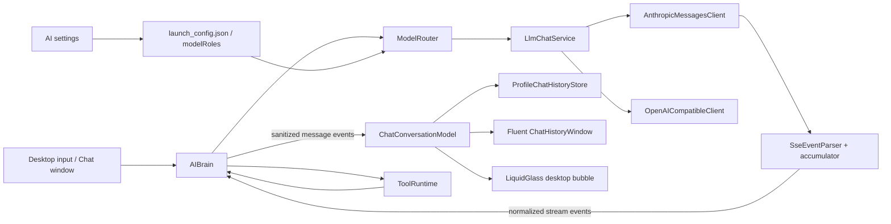
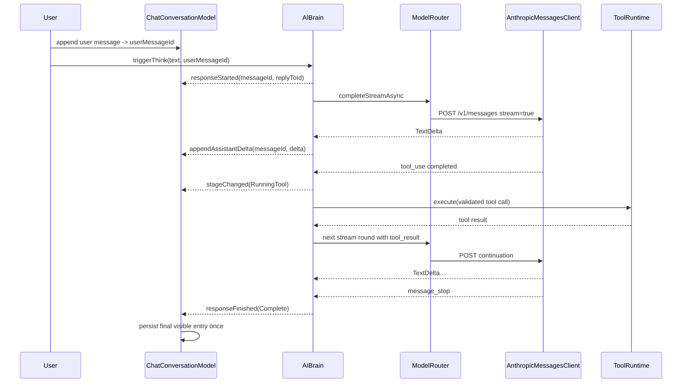
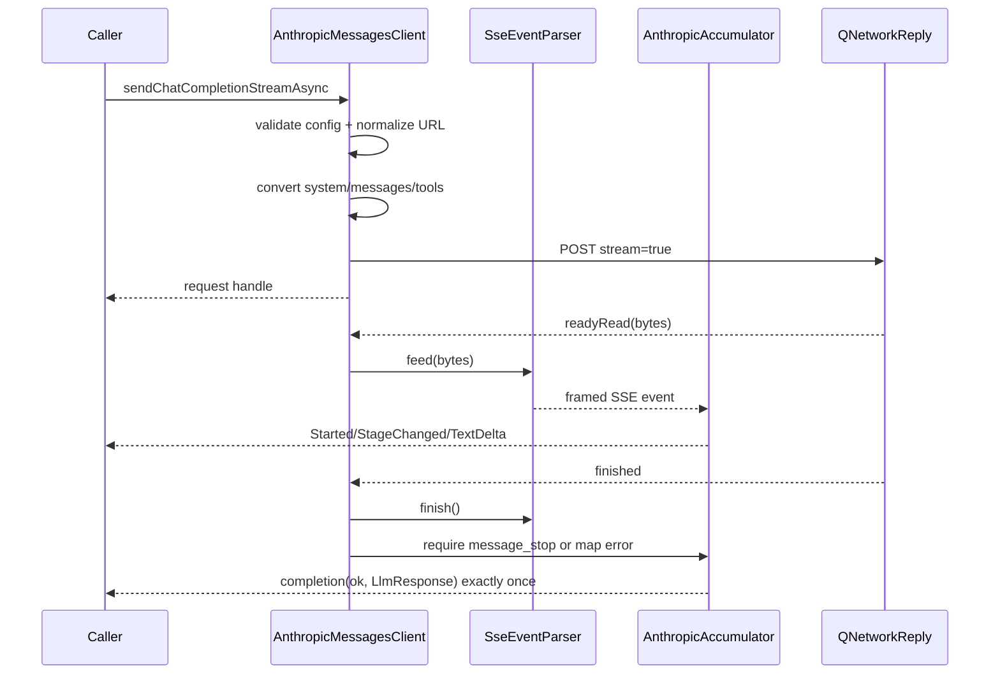

# 桌宠流式聊天与 Fluent 界面重构 - 桌面端系分

## 文档修订历史

| 日期 | 版本 | 修订人 | 内容 |
|---|---|---|---|
| 2026-08-27 | 1.0 | Codex | 基于已确认的 `design.md` 起草完整桌面端技术方案 |

## 涉及仓库

| 仓库 | 技术栈 | 职责 |
|---|---|---|
| `DesktopPet` | C++20 / Qt 6 / CMake / Python 3 / PySide6 | LLM 协议、AI 编排、聊天存储、桌面 UI 与 launcher 配置 |

## 1. 背景与全局约束

### 1.1 背景与范围

现有 `OpenAICompatibleClient` 仅支持非流式 JSON，会强制将 `stream=true` 改为 `false`；`AIBrain` 只在整个响应与工具调用都解析完成后向 UI 发送完整文本。聊天历史写入全局 `log/chat_history.jsonl`，独立聊天窗口是传统左右高饱和气泡列表。

本设计在不替换现有模型路由、工具策略、记忆和语音体系的前提下，新增 Anthropic Messages 真流式链路，并将完整聊天窗口和桌面气泡统一到同一个按 `profileId` 隔离的消息模型。

### 1.2 已确认结论

- [2026-08-27] 完整聊天是可移动小窗口，不是屏幕侧边栏。
- [2026-08-27] 阅读分割线表示上次关闭或收起完整窗口时最后读到的消息。
- [2026-08-27] 每个 `profileId` 只维持一条永久连续对话，不提供会话列表。
- [2026-08-27] 长回复在桌面气泡中自动播放，悬停暂停，并允许手动翻页。
- [2026-08-27] 实施必须先完成流式输出和工具解析，再改造界面。
- [2026-08-27] 文本主接口使用 Anthropic Messages，保留 OpenAI-compatible 客户端。
- [2026-08-27] 文本和视觉服务分别配置协议、Base URL、API Key 和模型；其他文字角色默认继承文本服务并可覆盖。
- [2026-08-27] macOS 当前无法运行仓库内 ONNX Runtime，本地验收只要求不依赖 ONNX 的最小测试与 CMake 配置检查。

### 1.3 共享状态机

影响范围：§3.2、§3.3、§3.4、§3.5、§3.6。

```cpp
enum class ChatActivityStage {
    WaitingForModel,
    StreamingText,
    PreparingTool,
    RunningTool,
    Finalizing
};

enum class ChatMessageStatus {
    Pending,
    Streaming,
    Complete,
    Interrupted,
    Stopped,
    Failed
};
```

`ChatMessageStatus` 是持久化的消息生命周期，合法迁移为：

```text
Pending -> Streaming -> Complete
Pending -> Failed
Pending/Streaming -> Stopped
Streaming -> Interrupted
```

`ChatActivityStage` 是不持久化的活动展示轴，合法迁移为：

```text
WaitingForModel -> StreamingText
WaitingForModel/StreamingText -> PreparingTool -> RunningTool -> Finalizing
Finalizing -> WaitingForModel/StreamingText
```

活动阶段变化不改变消息状态；收到首个非空可见正文时消息才从 `Pending` 转为 `Streaming`。同一轮工具续写始终复用同一 `messageId`。任何终态只能写入一次，迟到网络回调由 request generation 和取消标记丢弃。

### 1.4 共享数据模型

影响范围：§3.2、§3.3、§3.4、§3.5、§3.6。

```cpp
enum class LlmStreamEventType { Started, StageChanged, TextDelta };

struct LlmStreamEvent {
    LlmStreamEventType type;
    QString requestId;
    ChatActivityStage stage = ChatActivityStage::WaitingForModel;
    QString textDelta;
};

struct ChatMessage {
    QString role;
    QString content;
    QString name;
    QString toolCallId;
    QJsonArray toolCalls;
    QJsonArray transportBlocks; // 仅当前 provider 请求链内使用
};

struct ChatHistoryEntry {
    QString id;
    QString role;       // user / assistant / system
    QString replyToId;  // assistant 对应的 user 消息 ID；主动消息为空
    QString content;
    QDateTime timestamp;
    ChatMessageStatus status = ChatMessageStatus::Complete;
};
```

`LlmResponse::transportBlocks` 保存当前 Anthropic 响应按原顺序完成的 provider-native content blocks；§3.3 将其原样赋给下一轮 assistant `ChatMessage::transportBlocks`。该字段只在当前工具请求链内存在，不进入 `AiCallLogger`、聊天历史、长期记忆或 UI 信号。Anthropic adapter 遇到非空 `transportBlocks` 时必须原样回传，不能从可见正文和工具调用重新拼装，以保留 extended-thinking 签名和块顺序。

### 1.5 全局异常与重试策略

影响范围：全部 §3.X。

| 错误码 | 场景 | 全局处理 |
|---|---|---|
| `LLM_PROVIDER_UNSUPPORTED` | route 声明未注册协议 | 首字前尝试后备 route，全部失败则结束 |
| `LLM_STREAM_PROTOCOL_ERROR` | SSE 或 Anthropic 事件不合法 | 首字前可 fallback，首字后转 `Interrupted` |
| `LLM_STREAM_INTERRUPTED` | 已展示文本后断线 | 保留部分正文，不自动换模型 |
| `LLM_REQUEST_CANCELLED` | 用户停止或窗口销毁 | 终止 reply，转 `Stopped`，屏蔽迟到回调 |
| `CHAT_HISTORY_OPEN_FAILED` | profile 历史无法读取 | 降级为本次进程内聊天，不改写旧文件 |
| `CHAT_HISTORY_WRITE_FAILED` | 终态消息无法追加 | UI 保留消息并记录脱敏警告，不影响 AI 回复 |
| `MODEL_CONNECTION_INVALID` | launcher 连接测试失败 | 分类显示认证/地址/模型/协议错误，不输出 Key |

重试以“是否已发布可见文本”为硬边界：未发布时沿用 ModelRouter 路由 fallback；已发布时不自动重试或换 route。各模块不使用空 catch，网络回调必须 exactly-once 收口。

### 1.6 共享安全与隐私约束

影响范围：§3.2、§3.3、§3.4、§3.7。

- API Key 仅通过请求头发送，日志、InfoBar 和测试错误均不回显。
- `thinking_delta`、`signature_delta`、原始工具参数碎片和原始工具输出不发布到 UI。
- Anthropic transport blocks 只在当前请求链内存在，结束后释放。
- profile 聊天文件尽力设置为 owner read/write；权限设置失败记录警告，不删除数据。
- 本期 API Key 继续由 launcher 写入用户 AppData 下的 `launch_config.json`，密钥管理不扩展到 Keychain。

### 1.7 共享线程与生命周期约束

影响范围：§3.2、§3.3、§3.5、§3.6。

Qt 网络回调、`AIBrain` 信号、`ChatConversationModel` 修改和所有 Widget 更新均在其所属 Qt 事件线程执行。`QNetworkReply` 由客户端拥有到 finished/abort 收口；`PetWindow` 销毁顺序为停止当前回复、将草稿收口为 `Stopped`、关闭聊天窗口和气泡、再销毁 AI runtime。

## 2. 总体架构与代码变更

### 2.1 系统架构



### 2.2 核心时序



### 2.3 代码变更清单

| 标记 | 路径 | 变更 |
|---|---|---|
| 🆕 | `core/ai/llm/llm_stream_types.h` | 流式事件、取消句柄和回调契约 |
| 🆕 | `core/ai/llm/sse_event_parser.*` | 纯增量 SSE framing 解析 |
| 🆕 | `core/ai/llm/anthropic_messages_client.*` | Anthropic 请求转换、流累计和工具块解析 |
| 🔧 | `core/ai/llm/llm_client.h` / `llm_chat_service.*` / `openai_compatible_client.*` | 新增流式入口、provider 注册与非流式适配 |
| 🔧 | `include/ai_types.h` | 新增 provider transport state、Anthropic 版本与额外请求头配置 |
| 🔧 | `core/ai/model/model_router.*` / `llm_chat_model_client.*` | 流式路由、首字边界与取消传递 |
| 🔧 | `core/ai/ai_brain.*` / `ai_brain_loop.cpp` / `ai_brain_router.cpp` | 单条回复状态、工具续写、停止和脱敏 UI 信号 |
| 🆕 | `core/ai/chat/chat_types.*` / `profile_chat_history_store.*` | profile 历史、旧文件迁移与 JSONL 编解码 |
| 🆕 | `ui/chat_conversation_model.*` | 两层 UI 共享的消息与阅读状态 |
| 🔧 | `ui/chat_history_window.*` | Fluent 连续时间流、分割线、流式正文和自适应输入 |
| 🆕 | `ui/streaming_text_paginator.*` / `bubble_playback_controller.*` | 自然分段和播放状态机 |
| 🔧 | `ui/liquidglasschatbubble.*` / `petwindow_bubble.cpp` / `petwindow_screen_chat.cpp` / `petwindow.*` | 桌面输入条、回复控件和共享 model 接入 |
| 🔧 | `launcher/app_state.py` / `config_loader.py` / `pages/ai_page.py` | 文本/视觉独立配置与文字角色覆盖 |
| 🆕 | `launcher/api_connection_tester.py` | provider-specific 最小连接测试和脱敏错误 |
| 🔧 | `config/default_common_config*.json` | Anthropic provider 示例和独立 vision route 默认值 |
| 🔧 | `CMakeLists.txt` | 注册新源文件与不依赖 ONNX 的最小测试目标 |
| 🆕/🔧 | `tests/test_anthropic_messages_client.cpp` 等 | 协议、编排、存储、分页、UI model 和 launcher 配置测试 |

## 3. 详细设计

### 3.1 模块概览

| 顺序 | 模块 | 职责 | 依赖 |
|---:|---|---|---|
| 1 | §3.2 Anthropic Messages 流式客户端 | 将 Anthropic HTTP/SSE 转换成安全的规范化流事件 | 无 |
| 2 | §3.3 对话流式编排 | 在 ModelRouter/AIBrain 中编排流、工具、fallback 与停止 | §3.2 |
| 3 | §3.4 身份化聊天存储 | 管理 profile 历史、稳定 ID、终态持久化与阅读位置 | §3.3 消息生命周期 |
| 4 | §3.5 Fluent 完整聊天窗口 | 展示连续时间流并提供完整输入/停止交互 | §3.3、§3.4 |
| 5 | §3.6 桌面快捷聊天与分段气泡 | 提供快捷输入、增量分段和可控自动播放 | §3.3、§3.4、§3.5 |
| 6 | §3.7 Launcher 独立模型配置 | 编辑和验证文本/视觉的独立 route | §3.2 provider 契约 |

### 3.2 Anthropic Messages 流式客户端

#### 3.2.1 模块定位

本模块是 Anthropic Messages HTTP/SSE 与现有 `LlmResponse`/`ChatMessage` 之间的 provider adapter：它负责线级协议正确性、增量事件 framing、工具参数组装和取消，不决定是否执行工具、不向 UI 选择文案。

#### 3.2.2 核心服务接口

```cpp
struct SseEvent {
    QString event;
    QByteArray data;
};

class SseEventParser {
public:
    using EventHandler = std::function<void(const SseEvent&)>;
    explicit SseEventParser(EventHandler handler);
    bool feed(const QByteArray& chunk, QString* errorMessage);
    bool finish(QString* errorMessage);
};

class LlmRequestHandle {
public:
    virtual ~LlmRequestHandle() = default;
    virtual void cancel() = 0;
    virtual bool isCancelled() const = 0;
};

using LlmStreamObserver = std::function<void(const LlmStreamEvent&)>;

class LlmClient {
public:
    virtual std::shared_ptr<LlmRequestHandle> sendChatCompletionStreamAsync(
        const LlmConfig& config,
        const QList<ChatMessage>& messages,
        const QJsonArray& tools,
        LlmStreamObserver observer,
        LlmCompletionHandler completion) = 0;
};

class AnthropicMessagesClient final : public LlmClient {
public:
    std::shared_ptr<LlmRequestHandle> sendChatCompletionStreamAsync(
        const LlmConfig& config,
        const QList<ChatMessage>& messages,
        const QJsonArray& tools,
        LlmStreamObserver observer,
        LlmCompletionHandler completion) override;
};
```

`SseEventParser::feed` 入参：

| 字段 | 值来源 | 约束 |
|---|---|---|
| `chunk` | 调用方传入 | `QNetworkReply::readAll()` 的未处理字节，可为任意分包 |
| `errorMessage` | 调用方传入 | 可空指针；失败时接收脱敏 framing 错误 |

`sendChatCompletionStreamAsync` 入参：

| 字段 | 值来源 | 约束 |
|---|---|---|
| `config` | 调用方传入 | ModelRouter 选中 route 的 `LlmConfig` |
| `messages` | 调用方传入 | 当前 working messages，包含可选 tool result |
| `tools` | 调用方传入 | `ToolRegistry::allToolSchemas()` 的 OpenAI function schema |
| `observer` | 调用方传入 | 可空；只接收 §1.4 规范化事件 |
| `completion` | 调用方传入 | 必填；每次请求 exactly-once 调用 |
| endpoint | 系统推导（来源: `config.baseUrl`） | 按 §4.1 规范化 |
| `anthropic-version` | 配置默认值（来源: `LlmConfig::anthropicVersion`） | 默认 `2023-06-01` |

#### 3.2.3 模块业务流程



内容块累计规则：`text_delta` 同时追加到 response content、当前 text transport block 并发布 `TextDelta`；`input_json_delta` 只追加到当前 `tool_use` 缓冲；块结束时解析为 JSON object，失败则整次响应按协议错误收口。所有完成块按 index 原序写入 response transport state，以便工具续写；`thinking` 与 `signature` 不发布可见 delta。

#### 3.2.4 数据变更

N/A — 本模块不涉及持久化数据写入。请求累计器和工具 JSON 碎片在 completion 或 cancel 后释放；transport blocks 最多存活到同一工具请求链结束，且禁止进入日志、历史或长期记忆。

#### 3.2.5 实现锚点

| 现有锚点 | 实测签名/格式 | 本模块处理 |
|---|---|---|
| `OpenAICompatibleClient::sendChatCompletionAsync` | `(LlmConfig, QList<ChatMessage>, QJsonArray, LlmCompletionHandler)` | 保留其完成回调语义，增加流式入口适配 |
| `OpenAICompatibleClient::buildMessagesArray` | `ChatMessage -> role/content/name/tool_calls/tool_call_id` | Anthropic 转换单独实现，不复用 OpenAI payload |
| `LlmResponse::toolCalls` | `QList<LlmToolCall>` | `tool_use` 块完成后填入，不提前暴露半成品 |
| `ChatMessage::transportBlocks` / `LlmResponse::transportBlocks` | `QJsonArray`，provider-native content blocks | 响应按 block index 原序保存；续写优先原样回传，禁止与合成块重复 |
| `LlmUsage` | prompt/completion/total/reasoning/cache 字段 | message_start/message_delta 的 usage 增量合并，未提供字段保持 0 |

工具 schema 消歧：输入为 `{"type":"function","function":{"name","description","parameters"}}`，Anthropic 输出为 `{"name","description","input_schema"}`。`ChatMessage::toolCalls[].function.arguments` 为 JSON 字符串，转换时必须解析为 `tool_use.input` object。

#### 3.2.6 异常场景

| 类型 | 场景 | 处理策略 | 与 §1.5 关系 |
|---|---|---|---|
| 业务异常 | provider 为 Anthropic 但 model/baseUrl/apiKey 任一为空 | 抛：同步以失败 completion 收口，不发请求 | 映射 `LLM_PROVIDER_UNSUPPORTED` 或配置错误，允许上层首字前 fallback |
| 业务异常 | `tool_use` 结束时 arguments 不是 JSON object | 抛：协议错误收口，不执行工具 | 映射 `LLM_STREAM_PROTOCOL_ERROR` |
| 系统异常 | HTTP 超时/断线 | 重试由上层决定；客户端只 exactly-once 返回脱敏网络错误 | 上层依“是否已发文本”选 fallback 或 interrupted |
| 系统异常 | cancel 与 reply finished 同时到达 | 降级：原子终态门禁保证只回调一次 | 统一映射 `LLM_REQUEST_CANCELLED` |

#### 3.2.7 关键行为场景

- `SseEventParser::feed`：当 `event:`、`data:` 和空行被拆到三个 chunk 时，前两次 feed 不发布，收到空行后只发布一个完整 `SseEvent`，内部缓冲只保留尚未消费字节。
- `SseEventParser::finish`：当最后事件没有尾随空行但行结构完整时，finish 发布该事件并清空缓冲；存在未完成行时返回 framing 失败。
- `AnthropicMessagesClient::sendChatCompletionStreamAsync`：正常文本请求会构建标准 headers/body，每个 `text_delta` 按原顺序发布，`message_stop` 后 completion 返回内容与 usage 完整的 `LlmResponse`。
- `AnthropicMessagesClient::sendChatCompletionStreamAsync`：包含 tool_use 的响应在多个 `input_json_delta` 后生成一个参数完整的 `LlmToolCall`，thinking/signature 只进入 transport blocks，可见正文不包含其内容。
- `AnthropicMessagesClient::sendChatCompletionStreamAsync`：将上一轮 response transport blocks 放入 assistant `ChatMessage` 后续写时，请求体按原顺序只包含一份对应 blocks，thinking 签名、text 与 `tool_use` 均不丢失或重复。
- `LlmRequestHandle::cancel`：正在读取的 reply 被 abort，completion 只收到一次 cancel 错误，之后的 `readyRead/finished` 不再发布事件。

### 3.3 对话流式编排

> 依赖：§3.2 的 `LlmStreamEvent`、`LlmRequestHandle` 和 provider client 契约。

#### 3.3.1 模块定位

本模块是单轮用户对话的编排边界：`ModelRouter` 负责 provider/route fallback 和流取消传递，`AIBrain` 负责将多次模型请求、工具执行与本地直接路由收敛为一个稳定 `messageId` 的 UI 生命周期。

#### 3.3.2 核心服务接口

```cpp
class ModelCompletionClient {
public:
    virtual std::shared_ptr<LlmRequestHandle> completeOnceStream(
        const ModelRouteConfig& route,
        const QList<ChatMessage>& messages,
        const QJsonArray& tools,
        LlmStreamObserver observer,
        LlmCompletionHandler completion,
        const QString& petName) = 0;
};

class ModelRouter {
public:
    std::shared_ptr<LlmRequestHandle> completeStreamAsync(
        const ModelRequest& request,
        LlmStreamObserver observer,
        ModelCompletionHandler completion);
};

class AIBrain : public QObject {
    Q_OBJECT
public:
    void triggerThink(const QString& reason = "manual",
                      const QString& triggerTag = "manual",
                      const QString& replyToId = {});
    void stopCurrentResponse();

signals:
    void assistantResponseStarted(const QString& messageId,
                                  const QString& replyToId,
                                  const QString& triggerTag);
    void assistantResponseStageChanged(const QString& messageId,
                                       ChatActivityStage stage);
    void assistantResponseDelta(const QString& messageId,
                                const QString& textDelta);
    void assistantResponseFinished(const QString& messageId,
                                   ChatMessageStatus status,
                                   const QString& errorMessage);
};
```

`ModelRouter::completeStreamAsync` 入参：

| 字段 | 值来源 | 约束 |
|---|---|---|
| `request` | 调用方传入 | 沿用 `ModelRequest`，Dialogue 路由可携工具 |
| `observer` | 调用方传入 | 可空；只观察当前被选 route 的规范化事件 |
| `completion` | 调用方传入 | 必填；返回最终 route dimensions 或 DomainError |
| route 序号 | 系统推导（来源: `ModelRoleConfig::routes`） | 从第一个满足 constraints 且未熔断的 route 开始 |

`AIBrain::stopCurrentResponse` 入参：N/A；目标 request 由系统推导（来源: `m_activeDialogueResponse.requestHandle`）。

`assistantResponse*` 信号字段：

| 字段 | 值来源 | 约束 |
|---|---|---|
| `messageId` | 系统推导（来源: 对话触发时生成 UUID） | 同一用户请求与所有工具续写轮次不变 |
| `replyToId` | 调用方传入 | 用户发起时为 §3.4 创建的 user 消息 ID；主动触发时为空 |
| `triggerTag` | 调用方传入 | `user_request/proactive_chat/...` |
| `stage` | 系统推导（来源: 当前模型/工具阶段） | 仅取 §1.3 枚举 |
| `textDelta` | 系统推导（来源: provider `TextDelta` 或本地路由回复） | 不含 thinking/工具参数 |
| `status` | 系统推导（来源: 终态原因） | 必须是终态 |

#### 3.3.3 模块业务流程

1. `triggerThink` 创建 runtime session 和 `ActiveDialogueResponse`，生成稳定 `messageId`，保存可选 `replyToId`，发布 started/waiting，然后进入本地 IntentRouter。
2. DirectReply/NeedClarification/Rejected 将完整文本作为一个 delta 发布并进入相应终态；DirectToolCall 在执行前发布 RunningTool，输出仍收敛到同一 message ID。
3. NeedLLM 通过 `completeStreamAsync` 进入选中 route。ModelRouter 记录当前 attempt 是否已发布非空 TextDelta。
4. attempt 在首字前失败时可打开熔断并转下一 route；首字后失败时立即返回 `MODEL_STREAM_INTERRUPTED`，不重放上下文。
5. AIBrain 对每个 TextDelta 先追加到 active visible content，再发布 UI delta。序列号/request generation 不匹配的回调丢弃。
6. response 无工具或达到最大轮次时完成；有工具时将当轮 assistant 消息追加到 working messages，并把 `response.transportBlocks` 原样赋给该消息的 `transportBlocks`，再发布 PreparingTool/RunningTool、执行并追加 tool result。
7. 工具结果就绪后发布 Finalizing，以同一 active response 进入下一轮 `thinkInternal`。所有轮次正文按到达顺序累计，不插入人工换行。
8. Complete/Interrupted/Stopped/Failed 通过单一 `finishActiveResponse` 收口：追加最终 runtime event/记忆，发布 finished，清理 handle 和 busy 状态。旧 `assistantResponseReady` 仅在 Complete 后以整条可见正文发出，用于语音与兼容订阅者，UI 历史不再订阅它。

#### 3.3.4 数据变更

不新增持久化 schema。沿用现有 MemoryStore 和 EventLedger：

| 写入 | 时机 | 内容 | 边界 |
|---|---|---|---|
| `AssistantResponseProduced` | Complete 且可见正文非空 | 整条累计正文、triggerTag、modelRole | 每个 messageId 一次 |
| `ModelCallCompleted` | 每个 provider attempt 收口 | route/provider/model/duration/success | 每个 attempt 一次 |
| `ToolExecutionCompleted` | 每个工具收口 | 现有脱敏 summary | 沿用现有事务边界 |
| MemoryStore assistant message | Complete | 整条可见正文 | 不写 thinking/transport blocks |

Interrupted/Stopped 的部分文本只由 §3.4 聊天历史保存，不进入长期记忆，避免将未完成句子当作稳定事实。

#### 3.3.5 实现锚点

| 依赖点 | 现有签名/行为 | 设计后要求 |
|---|---|---|
| `ModelRouter::completeAsync` | `(ModelRequest, ModelCompletionHandler)`，route 失败直接下一路 | 保留给 Diary/Reflection；Dialogue 使用新 `completeStreamAsync` |
| `LlmChatModelClient::completeOnce` | route config 的 retryCount 强制为 0 | 流式入口继续保持 service-level 单 attempt |
| `AIBrain::thinkInternal` | `(reason, triggerTag, sessionId, toolRound, workingMessages)` | 新增/内联 active messageId，递归工具轮次不重建 active response |
| `m_requestGeneration` | 丢弃 teardown 后回调 | 与 request handle cancel 双重门禁，不删除现有 generation 检查 |
| `toolConfirmationRequired` | pending lambda 在用户确认后续调 `thinkInternal` | 等待确认时保持 active response，用户拒绝也以 tool_result 续写 |

#### 3.3.6 异常场景

| 类型 | 场景 | 处理策略 | 与 §1.5 关系 |
|---|---|---|---|
| 业务异常 | 工具轮次达上限但模型仍返回 tool_use | 降级：不执行新工具，已有可见正文则 Complete，无正文则 Failed | 使用现有 `m_maxToolRounds` 全局边界 |
| 业务异常 | 无 active response 时调用 stop | 兜底值：幂等 no-op，不发 finished | 不产生虚假 `LLM_REQUEST_CANCELLED` |
| 系统异常 | 首字后 provider 断线 | 降级：保留 active content 并以 Interrupted 收口 | 映射 `LLM_STREAM_INTERRUPTED`，禁止 fallback |
| 系统异常 | 工具执行失败 | 兜底值：将脱敏失败 `tool_result` 回传模型续写 | 沿用 ToolRuntime 策略，UI 只见 RunningTool/Finalizing |
| 系统异常 | 终态后到达旧 delta | 降级：由 messageId + generation + terminal guard 丢弃 | 满足 exactly-once 全局约束 |

#### 3.3.7 关键行为场景

- `ModelRouter::completeStreamAsync`：主 route 在发布文本前返回网络超时时，router 请求后备 route，observer 只看到后备 route 的正文，completion dimensions 标记 fallback route。
- `ModelRouter::completeStreamAsync`：主 route 已发布“你好”后断线时，router 不调用后备 route，completion 返回 `MODEL_STREAM_INTERRUPTED`，已发布文本不撤销。
- `AIBrain::triggerThink/thinkInternal`：普通流式回复发布一次 started、若干 delta 和一次 Complete，最终 `assistantResponseReady` 内容等于所有 delta 连接结果。
- `AIBrain::triggerThink/thinkInternal`：用户消息 ID 作为 `replyToId` 原样出现在 started 信号中且跨工具轮次不变；主动触发未提供 ID 时 started 中该字段为空。
- `AIBrain::thinkInternal`：模型先输出解释、再请求工具、工具后续写结论时，两段文本使用同一 messageId，阶段按 Streaming/PreparingTool/RunningTool/Finalizing/Streaming 迁移，历史只产生一条 assistant 消息。
- `AIBrain::stopCurrentResponse`：流式期间调用后取消当前 reply，保留已累计文本，只发布一次 Stopped，busy 状态恢复可接收下一次用户请求。
- `AIBrain::tryHandleRoutedIntent`：本地 DirectReply 不发网络请求，但 UI 仍收到 started、单个 delta 和 Complete，与流式 UI 契约一致。

### 3.4 身份化聊天存储

> 依赖：§3.3 的 `assistantResponseStarted/Delta/StageChanged/Finished` 生命周期和稳定 `messageId`。

#### 3.4.1 模块定位

本模块是单个桌宠身份的聊天事实源：`ProfileChatHistoryStore` 处理 profile 路径、JSONL 编解码、迁移和跨进程短锁；`ChatConversationModel` 将用户输入和 AIBrain 流式事件收敛成可被完整窗口与桌面气泡共享的内存消息序列。

#### 3.4.2 核心服务接口

```cpp
struct ProfileChatStoreOptions {
    QString appDataRoot;
    QString profileId;
    QStringList registeredProfileIds;
    QString legacyHistoryPath;
};

class ProfileChatHistoryStore {
public:
    bool open(const ProfileChatStoreOptions& options, QString* errorMessage);
    QList<ChatHistoryEntry> load(QString* errorMessage) const;
    bool appendFinal(const ChatHistoryEntry& entry, QString* errorMessage);
};

class ChatConversationModel : public QObject {
    Q_OBJECT
public:
    bool initialize(const ProfileChatStoreOptions& options,
                    QString* errorMessage);
    QString appendUserMessage(const QString& text,
                              const QDateTime& timestamp = QDateTime::currentDateTime());
    void beginAssistantMessage(const QString& messageId,
                               const QString& replyToId = {},
                               const QDateTime& timestamp = QDateTime::currentDateTime());
    void appendAssistantDelta(const QString& messageId, const QString& delta);
    void setAssistantStage(const QString& messageId, ChatActivityStage stage);
    void finishAssistantMessage(const QString& messageId,
                                ChatMessageStatus status,
                                const QString& errorMessage = {});
    void markReadThrough(const QString& messageId);
    QString lastReadMessageId() const;
    QList<ChatHistoryEntry> messages() const;

signals:
    void messageInserted(int index, const QString& messageId);
    void messageChanged(int index, const QString& messageId);
    void assistantStageChanged(const QString& messageId, ChatActivityStage stage);
    void historyPersistenceWarning(const QString& safeMessage);
};
```

`ProfileChatHistoryStore::open` 入参：

| 字段 | 值来源 | 约束 |
|---|---|---|
| `appDataRoot` | 调用方传入 | `ProfileMigrationRequest::appDataRoot` |
| `profileId` | 调用方传入 | 已由 ProfileResolver 校验的 canonical UUID |
| `registeredProfileIds` | 调用方传入 | launcher registry 解析结果，用于旧数据归属判定 |
| `legacyHistoryPath` | 系统推导（来源: 当前工作目录的 `log/chat_history.jsonl`） | 仅用于一次性导入 |

`ChatConversationModel` 变更方法入参：

| 字段 | 值来源 | 约束 |
|---|---|---|
| `text` | 调用方传入 | trim 后非空，原文内部换行保留 |
| user `timestamp` | 配置默认值（来源: `QDateTime::currentDateTime()`） | 测试可显式注入 |
| assistant `messageId` | 调用方传入 | 来自 §3.3，同一 active response 唯一 |
| assistant `replyToId` | 调用方传入 | 来自 §3.3；用户发起时必须指向现存 user entry，主动消息允许为空 |
| `delta` | 调用方传入 | 非空时追加，不 trim |
| `status` | 调用方传入 | 只接受 Complete/Interrupted/Stopped/Failed |
| read `messageId` | 系统推导（来源: §3.5 最后完全可见行） | 必须存在于当前 model |

#### 3.4.3 模块业务流程

1. `initialize` 以 appDataRoot/profileId 建立 profile 目录，打开目标 JSONL，并根据 registeredProfileIds 判断是否可安全导入旧全局历史。
2. 只有目标历史为空、未记录迁移、旧文件存在，且有效 registeredProfileIds 只含当前 profile 时才导入。导入结果用 `QSaveFile` 原子激活，旧文件不删除。
3. `load` 逐行解码，对每个 ID 只保留首个合法终态记录；半行、超限行和无效枚举跳过。
4. user 消息在输入被接受时创建 UUID，以 Complete 终态插入 model 并立即 `appendFinal`。
5. assistant started 在 model 末尾插入带可选 `replyToId` 的 Pending 草稿；delta 将其转 Streaming 并原样追加；stage 另行发信号，不写入消息 content。
6. assistant finished 验证合法终态，更新内存消息并只调用一次 `appendFinal`。重复 finished 或未知 ID 不写盘。
7. `appendFinal` 对 `<history>.lock` 使用 `QLockFile` 短锁，将 compact JSON 和换行作为一次 append write，flush 后解锁。
8. 窗口隐藏时将最后完全可见 ID 写入 profile-scoped QSettings；该 ID 不存在时视为无阅读锚点。

#### 3.4.4 数据变更

按 §5.1 新增 profile JSONL，按 §5.2 新增 QSettings 键。写入语义如下：

| 操作 | 写入语义 | 一致性边界 |
|---|---|---|
| user append | 一条 compact JSONL | model 先生效，文件失败发 warning |
| assistant finish | 每 messageId 一条终态 JSONL | terminal guard + `QLockFile` |
| legacy import | 旧 schema 解码后写 schemaVersion 2 | `QSaveFile::commit` 前不替换目标 |
| last read | QSettings 覆盖当前 profile 键 | 窗口 hide/close 时 last-write-wins |

多进程同 profile 仅保证单行 append 不互相穿插；本期不提供跨进程实时 UI 同步，其他进程写入的消息在下次重新打开该窗口/重载历史时可见。

#### 3.4.5 实现锚点

| 依赖点 | 现有签名/数据 | 本模块处理 |
|---|---|---|
| `ProfileMigrationRequest` | `profileId`, `registeredProfileIds`, `appDataRoot` | 原样传入 store options，不从 pet name 重新推导 |
| `ProfileDataMigrator` | `<appDataRoot>/profiles/<profileId>` 已作为身份数据根 | 聊天历史放入同一 profile 根，不使用 CWD 作为新根 |
| 旧 `PetWindow::load/saveChatHistoryMessage` | `log/chat_history.jsonl`，role/content/timestamp | 迁移 codec 为缺失 id/status 生成 UUID/Complete，不继续直写旧路径 |
| QSettings 组织 | 全局 org/app 已与 launcher 对齐 | 键名使用 canonical UUID，无需额外转义 |

JSON 层级消歧：新历史每行为顶层 object，不包 `messages` 外层数组；`status` 使用小写字符串 `complete/interrupted/stopped/failed`，不写 Pending/Streaming；`replyToId` 仅在非空时编码，旧行缺失该字段按空值读取。

#### 3.4.6 异常场景

| 类型 | 场景 | 处理策略 | 与 §1.5 关系 |
|---|---|---|---|
| 业务异常 | 多个注册 profile 存在时发现旧全局历史 | 降级：保留旧文件且不导入任何 profile | 防止身份混写，不视为启动失败 |
| 业务异常 | duplicate/unknown assistant messageId 收到 delta 或 finish | 兜底值：忽略并记录不含内容的 warning | 维持每 ID 一个终态 |
| 系统异常 | history 文件包含损坏中间行 | 降级：跳过该行并继续加载后续合法行 | 不修改原文件，对应 `CHAT_HISTORY_OPEN_FAILED` 的局部降级 |
| 系统异常 | append 无法获取 lock 或写入失败 | 降级：保留 model 中消息，发布安全 warning | 映射 `CHAT_HISTORY_WRITE_FAILED`，不回滚 UI |

#### 3.4.7 关键行为场景

- `ProfileChatHistoryStore::open/load`：给定两个不同 profileId 和各自 JSONL 时，每个 store 只返回自己目录内的消息，同名宠物显示名不影响隔离。
- `ProfileChatHistoryStore::appendFinal`：合法 Complete assistant entry 被序列化为一行 schemaVersion 2 JSON，重新 load 后 id/content/status/timestamp 不变。
- `ProfileChatHistoryStore::open`：只注册一个 profile 且新历史为空时，旧 role/content/timestamp JSONL 原子导入并生成稳定新 ID，旧文件仍保留。
- `ChatConversationModel::appendUserMessage`：非空输入立即插入一条 Complete user entry、发出 inserted 且尝试持久化，返回其 UUID。
- `ChatConversationModel::begin/append/finishAssistantMessage`：多个 delta 原样连接到同一 entry，`replyToId` 在整个生命周期中不变，Complete 时只 append 一条终态 JSONL，重复 finish 不增加行数。
- `ChatConversationModel::markReadThrough`：给定存在的中间消息 ID 时，QSettings 仅更新当前 profile 的 read key，重建 model 后能返回同一 ID。

### 3.5 Fluent 完整聊天窗口

> 依赖：§3.3 的停止/重试语义和 §3.4 的 `ChatConversationModel`、阅读锚点与 profile 窗口状态。

#### 3.5.1 模块定位

本模块是一条长期桌宠对话的完整展示和编辑界面。它使用 C++/Qt Widgets 复刻 launcher 的 Fluent 设计语言，但保留原生顶级窗口边框以获得 macOS/Windows 稳定的移动、缩放和焦点行为；它不拥有 AI 或历史数据，只绑定 conversation model 并发出用户意图。

#### 3.5.2 核心服务接口

```cpp
class ChatHistoryWindow : public QWidget {
    Q_OBJECT
public:
    explicit ChatHistoryWindow(QWidget* parent = nullptr);
    void bindConversation(ChatConversationModel* model,
                          const QString& profileId,
                          const QString& petDisplayName);
    void revealConversation();
    QString lastFullyVisibleMessageId() const;

signals:
    void messageSubmitted(const QString& text);
    void stopRequested();
    void retryRequested(const QString& assistantMessageId);
};

class GrowingPlainTextEdit : public QPlainTextEdit {
public:
    void setHeightRange(int minimum, int maximum);
};
```

`bindConversation` 入参：

| 字段 | 值来源 | 约束 |
|---|---|---|
| `model` | 调用方传入 | `PetWindow` 拥有，生命周期长于窗口 |
| `profileId` | 调用方传入 | canonical UUID，用于 geometry QSettings 键 |
| `petDisplayName` | 调用方传入 | 只用于顶栏显示，不用于数据隔离 |

`messageSubmitted/retryRequested` 入参：

| 字段 | 值来源 | 约束 |
|---|---|---|
| `text` | 调用方传入 | `GrowingPlainTextEdit::toPlainText()` trim 后非空 |
| `assistantMessageId` | 调用方传入 | 用户点击 Interrupted/Failed row 的重试图标 |

`GrowingPlainTextEdit::setHeightRange` 入参由配置默认值（来源: 聊天设计令牌）提供，默认 44–120 px，minimum 必须小于等于 maximum。

#### 3.5.3 模块业务流程

1. 首次 bind 根据 model 当前消息建立 `ChatMessageRow`：user 右侧轻量强调底色，assistant 左侧以可选择正文为主，system 居中低强调。不创建会话侧边栏。
2. `revealConversation` 恢复 profile geometry，若窗口完全离开当前屏幕可用区域则 clamp 到主屏。
3. model 的 lastRead ID 存在且其后有新消息时，在对应 row 后插入唯一虚拟“上次看到这里”分割线，并将它滚动到视口上部约 1/3；无新消息时直接到底部。
4. messageInserted 增加 row；messageChanged 只更新指定 row 正文/终态，不重建整个列表。流式刷新以不超过 32ms 合并多个 delta。
5. 用户处于底部 24px 内时，新 delta 保持跟随底部；用户已上滚时不抢夺位置，只显示固定尺寸的向下图标按钮，点击回到最新消息。
6. 输入框文档高度变化时 clamp 到 44–120px，超出后仅输入框内滚动，不推移窗口其他控件。Enter 发送，Shift+Enter 换行。
7. active response 期间输入仍可编辑并保留草稿，主操作按钮从发送图标切换为停止图标；Enter 不发起第二个并发回复。
8. Interrupted/Failed 且 `replyToId` 可解析到 user entry 的行显示重试图标和 tooltip；重试信号由 `PetWindow` 找到原 user 文本后创建新的 user/assistant 消息，不改写旧中断消息。主动消息或旧历史缺少 `replyToId` 时不显示重试图标。
9. hide/close 时计算最后完全可见 row，调用 model markReadThrough 并保存 geometry。

#### 3.5.4 数据变更

本模块不直接写聊天 JSONL。它通过 §3.4 写入 `lastReadMessageId`，并直接写入 `chat/<profileId>/windowGeometry`。两者均在 hide/close 同一 Qt 事件回调中完成，无跨文件事务；geometry 写入失败不影响 read marker。

#### 3.5.5 实现锚点

| 现有锚点 | 实测行为 | 设计后要求 |
|---|---|---|
| `ChatHistoryWindow` | `QWidget`, 460x680, min 360x520, QScrollArea + row QLabel + QTextEdit | 保留顶级 native window 和可选文本，重构为 model-driven row |
| `ThemeManager::themeChanged` | 全局明暗主题信号 | 连接后刷新 window token 和已存在 row，不改变布局尺寸 |
| launcher `_ui.py` | HeaderCard 风格使用透明页背景、低对比边框、字体层级 | C++ 使用设计令牌复制语言，不依赖 Python/qfluentwidgets |
| `PetWindow::openChatHistoryWindow` | 每次 clear + 重放全历史 | 改为首次 bind，后续只 reveal/raise/activate |

设计令牌：内容间距使用 4/8/12/16/24px 尺度，卡面圆角不超过 8px，主消息字号 13–14px，顶栏标题 15px DemiBold，时间/状态使用低对比 caption。所有图标按钮固定 32x32px，使用 `QStyle::StandardPixmap` 中的发送/停止/方向/打开等熟悉符号并配 tooltip。

#### 3.5.6 异常场景

| 类型 | 场景 | 处理策略 | 与 §1.5 关系 |
|---|---|---|---|
| 业务异常 | lastRead ID 已不在当前历史 | 兜底值：不显示分割线，打开后定位底部 | 不改写旧 read key，关闭时重建新锚点 |
| 业务异常 | active response 时用户按 Enter | 兜底值：保留草稿且不发信号 | 保证单 active response 约束 |
| 系统异常 | 恢复 geometry 对应屏幕已移除 | 降级：clamp 尺寸并居中到主屏可用区 | 不阻塞窗口打开 |
| 系统异常 | theme 切换时正在流式刷新 | 降级：在 UI 线程先 apply token 再 flush pending delta | 不丢弃文本，不重建 message ID |

#### 3.5.7 关键行为场景

- `ChatHistoryWindow::bindConversation`：绑定包含 user/assistant/system 的 model 后，行顺序与 model 一致，assistant 正文可鼠标选择，窗口不创建会话列表。
- `ChatHistoryWindow::revealConversation`：当 lastRead 后有三条新消息时，只插入一条虚拟分割线并定位到其附近，虚拟行不进入 model 或 JSONL。
- `ChatHistoryWindow` 流式更新：用户在底部时新 delta 保持最新正文可见；用户上滚后同样 delta 不改变 scrollbar value，只显示向下按钮。
- `GrowingPlainTextEdit::setHeightRange`：从一行输入增长到多行时高度在 44–120px 内跟随 document，超出后外层布局不再位移。
- `messageSubmitted/stopRequested`：空闲时 Enter 发送 trim 后文本并清空输入；生成时主按钮发 stop，已编辑草稿保留。
- `retryRequested`：用户点击中断消息重试图标时发出该 assistant ID，原消息保持 Interrupted，新请求产生新 assistant ID。
- `lastFullyVisibleMessageId`：关闭前视口中有两条完全行和一条部分行时，返回第二条 ID，部分行不计为已读。

### 3.6 桌面快捷聊天与分段气泡

> 依赖：§3.3 的增量/阶段事件、§3.4 的共享 conversation model，以及 §3.5 的打开并定位完整聊天窗口能力。

#### 3.6.1 模块定位

本模块是不离开桌面的快捷对话层：输入气泡负责低干扰地随时发起消息，输出气泡将同一 assistant 消息的增量文本转为稳定、可阅读、可回看的页队列。完整文本仍以 §3.4 model 为唯一事实源，气泡分页不改写历史。

#### 3.6.2 核心服务接口

```cpp
struct PaginationUpdate {
    QStringList newlySealedPages;
    QString draftPage;
};

class StreamingTextPaginator {
public:
    void reset();
    PaginationUpdate feed(const QString& delta);
    PaginationUpdate finish();
};

class BubblePlaybackController : public QObject {
    Q_OBJECT
public:
    void reset(const QString& messageId);
    void appendSealedPages(const QStringList& pages);
    void updateDraftPage(const QString& page);
    void finishDraft();
    void setHovered(bool hovered);
    void toggleUserPause();
    void previous();
    void next();
signals:
    void pageChanged(const QString& text, int index, int total, bool draft);
    void playbackStateChanged(bool paused);
};

class ThinkingStatusSelector {
public:
    QString next(ChatActivityStage stage,
                 const QString& requestId);
    void reset(const QString& requestId);
};

class LiquidGlassChatBubble : public QWidget {
public:
    void showStreamingMessage(const QString& messageId);
    void setDisplayedPage(const QString& text,
                          int index,
                          int total,
                          bool draft);
    void setActivityText(const QString& text);
    void setPlaybackPaused(bool paused);
signals:
    void previousPageRequested();
    void nextPageRequested();
    void playbackToggleRequested();
    void openConversationRequested(const QString& messageId);
};
```

`StreamingTextPaginator` 入参：

| 字段 | 值来源 | 约束 |
|---|---|---|
| `delta` | 调用方传入 | 来自 conversation model 当前 assistant 的新增文本，不 trim |
| soft target | 配置默认值（来源: 分页器常量） | 96 个 Unicode 标量值 |
| hard maximum | 配置默认值（来源: 分页器常量） | 180 个 Unicode 标量值 |

`BubblePlaybackController` 入参：

| 字段 | 值来源 | 约束 |
|---|---|---|
| `messageId` | 调用方传入 | 新 assistant started 时重置播放队列 |
| `pages/page` | 调用方传入 | paginator update，空 draft 不创建可翻页页面 |
| `hovered` | 系统推导（来源: bubble enter/leave event） | hover 只暂停 timer，不改 userPause |
| reading duration | 系统推导（来源: 当前页文本长度） | `clamp(1800 + 55ms * scalarCount, 2400, 8500)` |

`ThinkingStatusSelector::next` 的 stage/requestId 均由调用方传入；选项集为配置默认值（来源: 内置分阶段预设），本期不从 launcher 编辑。

#### 3.6.3 模块业务流程

1. 输入气泡在桌宠下方保持固定宽度与高度，未 hover/未聚焦时将输入控件透明度降低但保留可点击区；点击、hover 或右键菜单请求后展开并聚焦。
2. Enter 提交后通过 `ChatConversationModel::appendUserMessage` 进入共享历史，再触发 AIBrain。active response 时输入框不重复发送，可继续保留用户未发草稿。
3. assistant started 后输出气泡重置 paginator/playback，立即显示 WaitingForModel 预设。在首个文本 delta 之前，每约 2 秒依 stage 选择不重复预设；阶段变更时允许立即换到对应预设。
4. 首个非空 delta 到达后停止等待预设 timer，feed paginator。段落换行总是自然边界；句号/问号/感叹号/分号在当前页达到 soft target 后封页；硬上限时回溯最近逗号或空白，否则在合法 Unicode 标量值边界切分。
5. draft page 只在用户正在查看最新页时就地更新；已封页进入队列后尺寸和文本不再变动。
6. playback 在页就绪后按阅读时长自动 next。hover 将 timer 暂停并在 leave 后从剩余时间恢复；previous/next 的手动操作进入 userPause，只有点击播放图标才恢复自动播放。
7. 工具期间如已有文本，保留当前页并在控件低强调状态区显示 RunningTool 预设；没有文本时以预设作为主内容。工具后新 delta 继续 feed 同一 paginator。
8. finish 将剩余 draft 封页。有未读后续页时不启动整体隐藏 timer；播放到最后页后按 `bubbleDurationMs` 隐藏输出，输入条仍存在。
9. 每页控件栏始终使用固定高度与 32x32 图标热区，只在有意义时启用 previous/next。打开图标发送当前 assistant messageId，完整窗口定位到对应 row。

#### 3.6.4 数据变更

N/A — 分页、播放位置、hover/userPause 和等待预设均是当前进程 UI 状态，不写入聊天 JSONL 或 QSettings。用户提交消息仍通过 §3.4 统一持久化。

#### 3.6.5 实现锚点

| 现有锚点 | 实测行为 | 设计后要求 |
|---|---|---|
| `LiquidGlassChatBubble` | 同一类同时支持 input/output，380px 宽，动态材质和文字对比度分析 | 保留两个实例与材质实现，新增固定控制区与流式页展示 |
| `PetWindow::showBubbleMessageAnimated` | 完整文本先按 200 QChar 分页，再 32ms 打字机 | 不再用打字机伪造流；由真 delta 驱动 paginator |
| `bubbleHideTimer` | 单 timer 直接隐藏 output | 当 playback 尚有未读页时不允许启动 |
| `setInputAutoFadeEnabled` | enter/leave 动画 line edit opacity | 保留机制，焦点内或有草稿时禁止自动隐藏 |
| `updateOutput/InputBubblePosition` | 相对宠物定位，output 有屏幕 clamp，input 无 clamp | 两者都使用当前 screen availableGeometry clamp，宽高变化不越界 |

控制图标使用 Qt 标准的 arrow/media-pause/media-play/open 图标，不使用文本圆角按钮；每个图标有 tooltip 和 accessibleName。

#### 3.6.6 异常场景

| 类型 | 场景 | 处理策略 | 与 §1.5 关系 |
|---|---|---|---|
| 业务异常 | paginator 收到空 delta 或 finish 时无文本 | 兜底值：不创建空页，保留状态或失败提示 | 不伪造 `...` 为 assistant 正文 |
| 业务异常 | 用户在第一/最后页请求 previous/next | 兜底值：幂等 no-op，索引不越界 | 不改变 userPause |
| 系统异常 | 动态背景捕获失败或屏幕切换 | 降级：使用主题安全底色并重新 clamp 位置 | 不中断流式正文 |
| 系统异常 | 高频 delta 使刷新 timer 重入 | 降级：合并 pending update，下一次 event loop flush | 正文顺序以 model content 为准，不丢字 |

#### 3.6.7 关键行为场景

- `StreamingTextPaginator::feed`：连续输入包含多个中文句号与段落换行的 delta 时，按原顺序产生完整页，页边界优先落在换行/句末，所有页加 draft 精确还原原文。
- `StreamingTextPaginator::feed/finish`：一段超过 hard maximum 且无标点的 Unicode 文本会切成多页，每页不超过上限，不切断 surrogate pair/combining sequence，finish 封存剩余文本。
- `BubblePlaybackController::appendSealedPages/updateDraftPage`：正在查看最新 draft 时文本就地更新；用户手动回到旧页时新 draft 不改变当前页或页面尺寸。
- `BubblePlaybackController::setHovered`：自动计时中 hover 保留剩余阅读时间，leave 后从剩余值恢复，不立即跳页。
- `BubblePlaybackController::previous/next/toggleUserPause`：手动翻页后自动播放停止，显式点击播放后从当前页重新计时。
- `ThinkingStatusSelector::next`：WaitingForModel、RunningTool 和 Finalizing 分别只从对应预设池取值，同 requestId 连续两次不重复，切换 request 后重置记忆。
- `LiquidGlassChatBubble::setDisplayedPage`：页数变化时正文区与固定控制区不互相覆盖，previous/next/pause/open 图标热区保持 32x32px。

### 3.7 Launcher 独立模型配置

> 依赖：§3.2 定义的 provider 标识、Anthropic endpoint/header 契约和 OpenAI-compatible 兼容边界。

#### 3.7.1 模块定位

本模块是用户可编辑的模型连接入口：将当前共用 provider/baseUrl/apiKey 的 launcher 状态拆分为文本和视觉两套完全独立的服务配置，并将它们写入现有 `modelRoles.<role>.routes[0]`。其他文字角色默认物化继承文本 route，但可在高级区域显式覆盖；不引入新的连接档案/引用 schema。

#### 3.7.2 核心服务接口

```python
@dataclass
class ModelEndpointState:
    provider: str = "openai-compatible"
    base_url: str = ""
    api_key: str = ""
    model: str = ""
    anthropic_version: str = "2023-06-01"

@dataclass
class ModelRoleOverrideState:
    enabled: bool = False
    endpoint: ModelEndpointState = field(default_factory=ModelEndpointState)

@dataclass
class AppState:
    text_service: ModelEndpointState = field(default_factory=ModelEndpointState)
    vision_service: ModelEndpointState = field(default_factory=ModelEndpointState)
    text_role_overrides: dict[str, ModelRoleOverrideState] = field(default_factory=dict)

def apply_model_service_settings(
    profile: dict,
    text_service: ModelEndpointState,
    vision_service: ModelEndpointState,
    overrides: dict[str, ModelRoleOverrideState],
) -> None: ...

class ApiConnectionTester(QObject):
    finished = Signal(str, bool, str, str)  # request_id, success, category, message

    def test(self, request_id: str,
             endpoint: ModelEndpointState) -> None: ...
```

`apply_model_service_settings` 入参：

| 字段 | 值来源 | 约束 |
|---|---|---|
| `profile` | 调用方传入 | 当前 active profile 的深拷贝，非原模板引用 |
| `text_service` | 调用方传入 | AI 页文本服务编辑器状态 |
| `vision_service` | 调用方传入 | AI 页视觉服务编辑器状态，不从 text 填充 |
| `overrides` | 调用方传入 | 只允许 `fastExtract/consolidation/diary` |
| role routeId | 配置默认值（来源: 现有 route ID） | 无 route 时分别创建 `<role>-primary` |

`ApiConnectionTester::test` 入参：

| 字段 | 值来源 | 约束 |
|---|---|---|
| `request_id` | 系统推导（来源: 每次点击生成 UUID） | 用于忽略旧测试回调 |
| `endpoint` | 调用方传入 | 当前分区编辑值，不要求先保存 |
| timeout | 配置默认值（来源: connection tester 常量） | 10 秒 |

#### 3.7.3 模块业务流程

1. `AppState.from_config` 优先读取 `modelRoles.dialogue.routes[0]` 为 text service，优先读取 `modelRoles.vision.routes[0]` 为 vision service；缺失时分别回退 profile 旧字段，但不把 text URL/Key 强行填入已存在的 vision route。
2. `fastExtract/consolidation/diary` 的第一 route 与 text service 的 provider/baseUrl/apiKey/model/anthropicVersion 全部等价时视为未覆盖；任一字段不同时在 UI 中显示为已开启覆盖。
3. AI 页用两个同级 `Section`“文本服务”和“视觉服务”展示 provider ComboBox、Base URL、PasswordLineEdit、model 和测试图标/命令按钮。两区控件绑定不同 state object。
4. provider 选择 `anthropic-messages` 时显示可折叠的 anthropic-version 高级字段；`openai-compatible` 时保留 state 但隐藏该控件。流式不是用户开关。
5. 高级模型分工对每个辅助文字角色提供 override SwitchButton。关闭时显示“继承文本服务”的只读摘要；开启时显示独立 endpoint 编辑器。
6. 保存时 text 写入 profile 旧字段和 dialogue first route，vision 只写入 vision first route/profile `visual_model`。未 override 辅助角色将 text 字段物化到各自 first route，override 角色写入自己 state；`routes[1:]`、limits 和未知字段原样保留。
7. 连接测试先本地校验 provider/URL/Key/model，再使用 `QNetworkAccessManager` 发最小非流式文本请求：Anthropic 使用 max_tokens=1 的 Messages body，OpenAI-compatible 使用 max_tokens=1 的 chat completions body。测试期间只禁用当前分区的测试按钮。
8. finished 仅在 request_id 与当前分区 active id 相等时显示 InfoBar。HTTP status/provider error 先分类，再移除 Key 原文和 Authorization/x-api-key 值，最后截断到 400 字符。

#### 3.7.4 数据变更

不新增独立配置文件，继续由 launcher 原子导出 AppData `launch_config.json`。主要 JSON 映射：

| UI 状态 | JSON 路径 | 写入语义 |
|---|---|---|
| text service | `modelRoles.dialogue.routes[0]` | 覆盖 first route 的 endpoint/model，保留 routeId/limits/fallbacks |
| vision service | `modelRoles.vision.routes[0]` | 仅使用 vision state，`supportsVision=true` |
| inherited text role | `modelRoles.<role>.routes[0]` | 将 text service 物化为显式值 |
| overridden text role | `modelRoles.<role>.routes[0]` | 使用该 role endpoint state |
| compatibility fields | profile `provider/baseUrl/apiKey/model/visual_model` | 文本值同步旧文本字段，视觉只同步 `visual_model` |

route 新增可选 `anthropicVersion` 和 `extraHeaders` object，C++ ConfigManager 结构化读取；`extraHeaders` 只接受 string value，非字符串值忽略并警告。

#### 3.7.5 实现锚点

| 现有锚点 | 实测行为 | 设计后要求 |
|---|---|---|
| `AiPage` provider ComboBox | 只有 `openai-compatible` | 增加 `anthropic-messages`，文本和 vision 各自一个 editor |
| `AppState` | 单个 provider/base_url/api_key/model + visual_model | 迁移为 endpoint objects，from_config 兼容旧已保存 JSON |
| `_sync_ui_managed_model_routes` | provider/base/key 同时写 dialogue 和 vision | 拆为 role-specific writer，禁止跨服务复制 Key/URL |
| `_first_model_role_route` | 只创建/修改 routes[0] | 继续复用，确保 fallbacks 不丢失 |
| `ConfigManager::routeFromJson` | 读 provider/baseUrl/apiKey/model/extraParams | 新增 anthropicVersion/extraHeaders，不把 headers 混入 body extraParams |
| `export_config` | tempfile + `os.replace` 原子导出 | 保留原子写入和 AppData 路径 |

#### 3.7.6 异常场景

| 类型 | 场景 | 处理策略 | 与 §1.5 关系 |
|---|---|---|---|
| 业务异常 | text 完整但 vision URL/Key/model 缺失 | 抛：视觉测试本地失败；保存允许但不用 text 值补齐 | 保证两服务隔离，运行时 vision role 自行不可用 |
| 业务异常 | provider 是未支持字符串 | 抛：页面标记配置无效，不发连接测试 | 对应 `MODEL_CONNECTION_INVALID` |
| 系统异常 | 连接测试 HTTP 401/403/404/429/5xx | 降级：分类后显示脱敏 InfoBar，不更改 state | 对应 §1.5 launcher 错误策略 |
| 系统异常 | 保存过程临时文件写入失败 | 抛：保留旧 `launch_config.json`，显示保存失败 | 沿用 launcher 原子导出策略，不部分替换 |

#### 3.7.7 关键行为场景

- `AppState.from_config`：当 dialogue 为 Anthropic URL/Key/model，vision 为另一 OpenAI-compatible URL/Key/model 时，恢复后两个 endpoint object 精确保留自己字段，不发生交叉覆盖。
- `apply_model_service_settings`：独立 text/vision 输入保存后，dialogue/vision first route 分别更新，现有第二 fallback route、limits 和未知字段与输入模板相同。
- `apply_model_service_settings`：fastExtract override 关闭而 diary override 开启时，fastExtract first route 等于 text service，diary first route 等于自己 endpoint，consolidation 不受 diary 影响。
- `ApiConnectionTester::test`：合法 Anthropic endpoint 生成 `/v1/messages`、`x-api-key`、`anthropic-version` 和 max_tokens=1 body，服务返回 2xx 后发出 success 分类。
- `ApiConnectionTester::test`：返回体同时包含用户 API Key 和超长 provider 错误时，finished message 中 Key 被替换，总长不超过 400 字符。
- `AiPage` 连接测试：同时启动 text 和 vision 测试时两个按钮独立 pending，旧 request_id 的迟到回调不覆盖新测试结果。

## 4. 外部协议契约

### 4.1 Anthropic Messages 请求

| 项 | 契约 |
|---|---|
| Method | `POST` |
| URL | 规范化后的 `<base>/v1/messages` |
| Headers | `content-type: application/json`、`x-api-key`、`anthropic-version`，加上经过校验的 `extraHeaders` |
| Body | `model`、`max_tokens`、`temperature`、`stream: true`、`system`、`messages`、可选 `tools` |
| Success | `text/event-stream`，以 `message_stop` 正常收口 |
| Failure | HTTP 非 2xx、SSE `error`、非法 JSON、缺失 `message_stop` 映射到 §1.5 错误码 |

Anthropic `system` 消息收集为顶层 system 文本；`assistant.toolCalls` 转为 `tool_use`；`tool` 角色转为 `user` 消息中的 `tool_result`。连续同角色消息在适配器内合并为一条 content block 数组，不改写上层 working messages。

### 4.2 Launcher 连接测试契约

连接测试由用户显式点击触发，向目标 provider 发送最小文本请求，只验证 URL、认证、模型和基础协议。视觉服务测试不上传桌面截图。响应只对 UI 返回 `success/category/message`，`message` 经脱敏后不得包含 API Key 或完整请求头。

## 5. 数据存储

### 5.1 Profile 聊天 JSONL

路径：`<appDataRoot>/profiles/<profileId>/chat_history.jsonl`。每行是一条终态消息：

```json
{"schemaVersion":2,"id":"uuid","role":"assistant","replyToId":"user-uuid","content":"...","timestamp":"2026-08-27T12:00:00.000+08:00","status":"complete"}
```

| 字段 | 类型 | 约束 | 值来源 |
|---|---|---|---|
| `schemaVersion` | integer | 固定 `2` | 编码器 |
| `id` | string | 非空、同 profile 唯一 | 消息创建时 UUID |
| `role` | string | `user/assistant/system` | 调用方 |
| `replyToId` | string（可选） | assistant 对应的 user ID；主动消息和旧迁移记录可缺失 | assistant started |
| `content` | string | user 必须非空；assistant 失败时可空 | 最终可见正文 |
| `timestamp` | ISO 8601 string | 必须可解析 | 消息创建时间 |
| `status` | string | §1.3 终态之一 | 回复状态机 |

追加后 flush 并尽力设置 owner-only 权限。启动读取时跳过非法或尾部半行，不回写修复原文件。

### 5.2 UI 状态

QSettings 使用以 `profileId` 隔离的键：

| 键 | 值 | 写入时机 |
|---|---|---|
| `chat/<profileId>/lastReadMessageId` | 最后完全可见的消息 ID | 窗口关闭/隐藏 |
| `chat/<profileId>/windowGeometry` | `QWidget::saveGeometry()` | 窗口关闭/隐藏 |
| `chat/<profileId>/legacyImportedV1` | bool | 唯一身份旧历史成功导入后 |

本方案不新增关系型表，因此无 SQL 变更和回滚 SQL。

## 6. 非功能性设计

### 6.1 性能与容量

- SSE parser 按收到字节增量处理，不在 `readyRead` 中重复复制已消费缓冲。
- UI 文本增量在事件循环内以最多 32ms 的节流合并刷新，但完成/停止事件立即 flush。
- 聊天历史一次载入保持现有简单模型；单条超长消息在解析时限制为 1 MiB，超限行跳过并警告。
- 桌面分段器只保留当前回复的页索引与文本，完整历史由 conversation model 持有。

### 6.2 一致性与降级

- 消息终态先在内存 model 生效，再尝试持久化；持久化失败不撤销用户已看到的内容。
- 非流式 provider 通过默认适配器发送单次 `TextDelta` 后完成，不伪造 token 级流式。
- 动态背景捕获失败时，液态玻璃使用主题安全底色，输入与翻页仍可用。
- launcher 连接测试失败不禁止保存，以允许离线编辑；启动时仍由 C++ ConfigManager 完成配置校验。

## 7. 测试与交付

### 7.1 自动化测试

| 目标 | 覆盖范围 |
|---|---|
| `anthropic_messages_client_tests` | URL/请求体/工具 schema 转换，SSE 半包粘包、文本、thinking、tool_use、usage、error、cancel |
| `streaming_dialogue_tests` | 首字前 fallback、首字后中断、工具续写、直接路由、停止和 exactly-once 终态 |
| `chat_history_tests` | profile 隔离、JSONL 编解码、半行跳过、唯一身份迁移、阅读标记 |
| `chat_ui_model_tests` | 流式追加、同 ID 工具续写、终态持久化一次、分割线位置 |
| `streaming_text_paginator_tests` | 中文标点、换行、硬上限、Unicode 边界、自动/悬停/手动播放 |
| `tests/test_launcher_config.py` / `test_api_connection_tester.py` | 文本与 vision 互不覆盖、角色继承/覆盖、provider 请求构建、Key 脱敏 |

### 7.2 本地验证命令方向

- Python：`python3 -m unittest tests.test_launcher_config tests.test_api_connection_tester`。
- CMake：优先使用已有 build tree 配置和不链接 ONNX 的独立 Qt Test 目标。
- C++：分别构建并运行上表最小目标；不以 `Desktop_Pet` 完整可执行文件在 macOS 上运行为门禁。

### 7.3 人工联调验收

在用户填入真实 Anthropic Messages 和视觉平台配置后验收：首字延迟、工具调用前后文本连续性、停止生成、长回复自动播放、悬停暂停、阅读分割线、两个 Base URL 互不干扰以及明暗主题。真实 Key 不写入仓库、测试夹具或 Git 历史。
