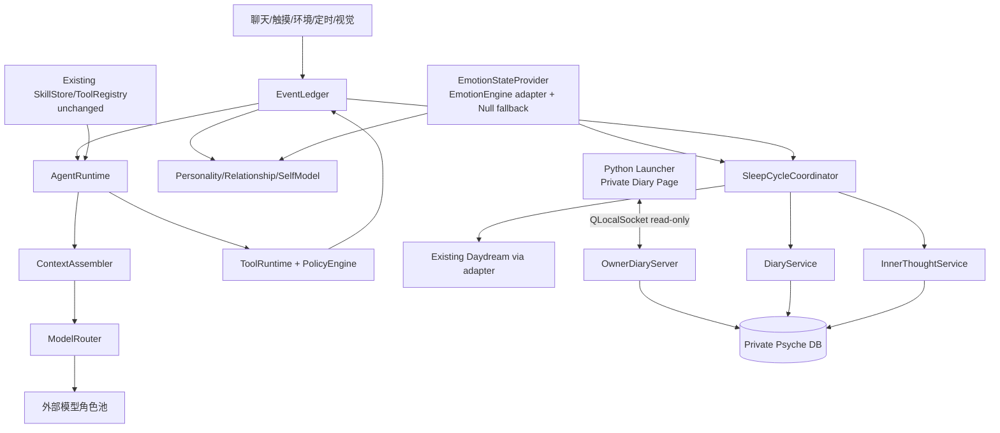
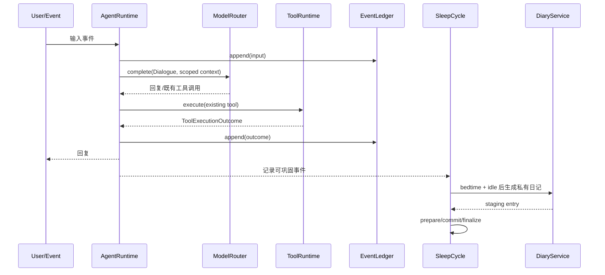
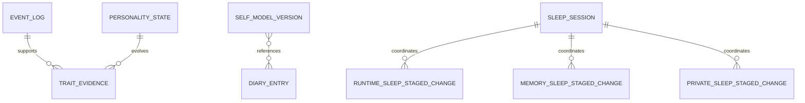

# 桌宠自主迭代桌面端技术设计

## 文档修订历史

| 日期 | 版本 | 修改人 | 说明 |
|---|---:|---|---|
| 2026-08-20 | 1.0 | Codex | 根据需求讨论形成现版本完整技术设计 |
| 2026-08-20 | 1.1 | Codex | 将情绪系统收缩为可替换接口与空实现，避免和未推送分支重复开发 |
| 2026-08-20 | 1.2 | Codex | 纠正阶段边界：移除现阶段 Skill/Tool 自修改治理，仅保留角色成长与只读日记入口 |
| 2026-08-20 | 1.3 | Codex | 按当前代码纠正人格/Prompt 锚点，并确定私有正文的 AEAD 与 Keychain 依赖 |
| 2026-08-20 | 1.4 | Codex | 对齐集成基线：复用现有 Daydream 与 EmotionEngine，增加真实情绪适配器并保留 Null fallback |

## 涉及仓库

| 仓库 | 路径 | 分支基线 | 技术栈 | 说明 |
|---|---|---|---|---|
| DesktopPet | 当前仓库根目录 | 集成后的 `master` | C++20、Qt6、SQLite、Python/PySide6 | 单仓库；C++ 运行时与 Python launcher 共同交付 |

## 1. 背景、目标与全局约束

### 1.1 背景

DesktopPet 已具备 LLM 对话、工具注册与策略、记忆、声明式 Skill、主动调度和静态人格模板，但角色状态仍缺少长期连续性：

- `AIBrain` 同时承担模型调用、上下文、记忆、技能匹配和工具调度，职责集中。
- 全局只有一套文本模型配置，视觉模型仅作为额外字段存在。
- 当前已具备通用 Prompt 模板与独立 `IdentityBaseline` 的最小投影；现有 `PetPersonality` 仅服务提醒概率、时间扰动和提醒话术，不是 LLM 人格模型。
- 现有 Skill/Tool 能力可继续使用，但本阶段不改变其存储、执行和权限模型。
- Daydream 已具备可中断的记忆巩固实现；私有心理摘要、睡前日记、跨库睡眠事务和模型不可见的所有者读取入口尚不存在。

本设计把基础模型视为可替换的认知资源，将身份连续性、人格、关系、自我叙事和私有反思保存在本地受控系统中。

### 1.2 目标

1. 支持对话、提取、巩固、日记和视觉等角色分别选择外部模型，并共享同一角色状态。
2. 建立事件账本、关系、人格基线和自我模型，使角色能长期、缓慢、可解释地成长；情绪只通过稳定接口接入，不在本次实现其内部逻辑。
3. 在现有可中断 Daydream 上建立睡眠循环，补充私有内心活动整理和每日睡前日记。
4. Python launcher 提供只读的所有者日记入口，但不直接读取领域表或私有密钥；模型不知道该入口存在。
5. 保持现有声明式 Skill、ToolRegistry 和工具权限行为不变，为未来实验 fork 留出接口边界但不提前实现治理系统。

### 1.3 范围边界

现版本实现范围：

- 事件账本、多模型角色路由和最小上下文投影。
- 人格、关系、自我模型及其长期证据；人格静默、缓慢变化。
- 现有 Daydream 的睡眠编排、心理摘要、每日睡前日记和多库恢复协议。
- 模型不可见、只读的所有者日记访问入口。
- 情绪消费接口、现有 `EmotionEngine` 的只读适配器与中性空实现；不重做情绪逻辑。

现版本明确不实现：

- Agent 自主创建、修改、删除、评测、晋升或回滚 Skill/Tool/Prompt/RoutePolicy。
- Artifact Registry、组合工具 DSL、动态工具目录、治理数据库、审核/灰度/回滚 UI。
- 基础模型权重、C++/Python 源码、脚本、二进制、插件或 Harness 的自主修改。
- 现有声明式 Skill 格式、SkillStore、SkillMatcher、ToolRegistry 和工具权限模型的改造。
- 新的情绪算法、情绪持久化或 Appraisal 流程；自主迭代层只消费现有情绪状态。
- 第二套 Daydream 巩固算法、并行记忆 schema 或重复调度器。

上述自修改与治理能力统一属于当前版本稳定后的实验 fork，不进入本系分的实现任务、SQL、测试或验收范围。

### 1.4 已确认结论

- [2026-08-20] 采用“分层认知自我迭代”：冻结基础模型权重，优先演化外置人格、记忆、技能和策略。
- [2026-08-20] 初始人格是高惯性先验而非永久不可变规则；长期、多场景证据可缓慢改变人格基线。
- [2026-08-20] 人格变化静默发生，不弹确认；角色自我模型知道自身变化，但不主动报告内部参数。
- [2026-08-20] 内心活动不展示在实际对话中；只保存专门生成的心理摘要，不保存模型原始推理轨迹。
- [2026-08-20] 每日睡前写自由日记；日记对模型是私有空间，所有者可通过模型不可见的管理入口查看。
- [2026-08-20] 项目依赖外部模型，不同认知角色可以使用不同模型；产品内“私有”不等同于对模型服务商绝对保密。
- [2026-08-20] 声明式 Skill/组合工具的自主创建、修改与治理不属于现阶段；待当前版本稳定后在实验 fork 中重新设计。
- [2026-08-20] Python launcher 不直接读取领域 SQLite 或私有密钥，使用 `QLocalSocket` 调用 C++ 只读 OwnerDiaryServer。
- [2026-08-20] 技术设计写入本地 `master`；后续实现从 `master` 新签独立功能分支。
- [2026-08-20] 情绪系统已合入基线；本设计不得复刻其算法或 schema，只新增 `EmotionEngine` 只读适配器与 `NullEmotionStateProvider` fallback。
- [2026-08-20] 本文曾错误地把 Skill/Tool 自修改治理放入现阶段，现已移除；保留现有 Skill/Tool 行为不变。

### 1.5 睡眠循环状态机

```text
Idle -> Snapshotting -> Consolidating -> Journaling -> Committing -> Sleeping
Snapshotting|Consolidating|Journaling -> Cancelling -> RolledBack -> Idle
```

用户开始交互、任务即将到期或系统繁忙时触发协作式取消。只有 `Committing` 完成后才更新正式记忆、自我模型和日记索引。

### 1.6 共享数据模型

| 模型 | 关键字段 | 说明 |
|---|---|---|
| `EventRecord` | `eventId/type/occurredAt/source/sessionId/payload/privacy` | 只追加事实账本；payload 入库前脱敏 |
| `ModelRoleConfig` | `role/provider/baseUrl/model/limits/fallbackRole` | 各认知任务独立配置 |
| `IdentityBaseline` | `schemaVersion/traits/speakingStyle/anchorStrength` | 新增的 LLM 初始人格先验；与提醒系统 `PetPersonality` 完全分离 |
| `StateSnapshot` | `emotion/personality/relationship/selfModel/version` | 上下文构建读取的不可变快照 |
| `OwnerDiaryRequest` | `requestId/action/payload/authContext` | 只读的所有者日记查询，支持请求幂等和最小授权 |

### 1.7 全局校验与权限约束

- 所有 JSON payload 先通过版本化 Schema 校验；未知字段保留但不参与权限推导。
- 日记正文、内心活动和密钥不得进入普通 Event payload、LLM 调用日志或普通工具结果。
- 私有正文使用 libsodium `crypto_aead_xchacha20poly1305_ietf_*`；AAD 固定包含 schema version、profile id、record type、record id 和 key version，密钥由 QtKeychain 读写且不得进入配置、SQLite、命令行或日志。
- 运行中 AgentSession 固定人格、自我状态和配置版本，避免一次回复中途切换角色状态。
- 人格等领域状态使用 `expectedVersion` 做 CAS；冲突时调用方重新读取，不做最后写入者覆盖。
- 现有 Skill/Tool 仅通过原有只读目录参与上下文和执行，不得获得 OwnerDiaryServer、私有库或密钥能力。

### 1.8 事务与并发约束

- 本地 SQLite 使用 WAL、`foreign_keys=ON`、`busy_timeout`，每个线程/进程使用独立连接。
- 领域数据库只由 C++ Repository/Service 打开和写入。Python launcher 的查询与命令均通过本地 IPC，不直接持有领域 SQLite 连接。
- 单写者边界不是因为 Python 的 SQLite 驱动不可靠，而是为了让权限、解密、CAS、跨表事务、schema migration 和内存 snapshot 发布始终经过同一套领域服务；若 launcher 直接访问库，会复制业务规则、扩大密钥暴露面并耦合表结构。SQLite 是 C++ 服务的存储实现，不是 launcher 的接口契约。
- 睡眠循环以 runtime DB 的 durable `sleep_session` 为协调者，各参与库使用本地 `sleep_staged_change`；Commit 决议前可 Abort，决议后只能幂等 finalize。迟到回调必须校验 session generation 后丢弃。
- Event Ledger 只追加；消费者以 offset/checkpoint 幂等处理，失败可重放。

### 1.9 全局异常与错误码

桌面端无统一异常切面。领域服务返回 `Result<T, DomainError>`；Qt 信号只传递已映射错误，不抛异常跨事件循环。系统异常记录审计事件，敏感字段脱敏。

| 错误码 | 含义 | 默认策略 |
|---|---|---|
| `EVT_SCHEMA_INVALID` | 事件 Schema 不合法 | 丢弃并记录脱敏告警 |
| `MODEL_ROLE_UNAVAILABLE` | 角色模型及降级均不可用 | 使用确定性兜底或延后任务 |
| `STATE_VERSION_CONFLICT` | 状态 CAS 冲突 | 重新读取后有限重试 |
| `SLEEP_CANCELLED` | 睡眠循环被交互打断 | 回滚并退避 |
| `OWNER_AUTH_FAILED` | 所有者 IPC 认证失败 | 断开连接并限速 |
| `PRIVATE_STORE_UNAVAILABLE` | 私有心理库不可用 | 禁止日记写入，不降级到普通库 |

## 2. 总体架构与代码变更

### 2.1 系统架构



### 2.2 关键流程



### 2.3 代码变更清单

| 标记 | 路径/模块 | 变更 |
|---|---|---|
| 🆕 | `core/ai/domain/domain_result.h` | 提供本设计共用的 `DomainError` 与 `Result<T, DomainError>`（含 `void` 特化）；当前仓库不存在等价类型 |
| 🔧 | `core/ai/ai_brain.*`、`ai_brain_loop.cpp`、`ai_brain_router.cpp` | 缩减为运行时协调器；接入事件、模型角色和状态快照；既有 Skill/Tool 路径保持不变 |
| 🆕 | `core/ai/runtime/agent_runtime_services.*`、`agent_bootstrap.*` | 统一依赖组装，替代 `PetWindow` 内的大段构造逻辑 |
| 🆕 | `core/ai/event/event_types.*`、`event_ledger.*`、`sqlite_event_repository.*` | 只追加事件账本与 checkpoint |
| 🔧 | `core/ai/llm/llm_chat_service.*`、`include/ai_types.h` | 支持显式角色配置、调用元数据和降级链 |
| 🆕 | `core/ai/model/model_router.*`、`model_role_registry.*` | 多模型路由、最小上下文和故障降级 |
| 🔧 | `core/configLoader/config_manager.*`、`config/default_common_config*.json` | 增加模型角色、成长和睡眠配置 |
| 🔧 | `launcher/app_state.py`、`pages/ai_page.py`、`config_loader.py` | 编辑并导出多模型角色配置 |
| 🆕/🔧 | `core/ai/identity/identity_baseline.*`、`core/ai/context/context_manager.*`、`core/ai/context_builder.*` | 新增独立 LLM 初始先验并注入 PersonaProjection；不修改提醒系统 `PetPersonality` 语义 |
| 🆕 | `core/ai/integration/emotion_state_provider.*` | 定义情绪快照/轨迹读取契约、`EmotionEngine` 只读适配器和 `NullEmotionStateProvider`；不实现情绪计算，不落新表 |
| 🆕 | `core/ai/identity/*` | 人格、关系、自我模型、证据账本和状态快照；通过接口读取可选情绪输入 |
| 🔧 | `core/ai/memory/*` | 接入事件来源、Daydream staging 和状态版本；保留现有检索能力 |
| 🆕/🔧 | `core/ai/reflection/*`、`core/ai/memory/daydream_consolidator.*` | SleepCycle 复用现有 Daydream，新增内心活动、日记、取消令牌和私有库 |
| 🆕 | `core/ai/owner/owner_diary_server.*` | 本地认证、只读的私有日记 IPC Facade；不注册为 Tool |
| 🆕 | `launcher/owner_diary_client.py`、`pages/private_diary_page.py` | 所有者按需查看日记；不提供 Skill/Tool 审核与治理界面 |
| 🔧 | `ui/petwindow_ai.cpp`、`ui/petwindow.h` | 使用 AgentBootstrap；窗口只桥接展示/输入事件 |
| 🔧 | `core/ai/scheduler/*` | 保留提醒调度；向 SleepCycle 提供任务冲突查询，不承担睡眠流程 |
| 🔧 | `CMakeLists.txt` | 注册新增 C++ 源文件和测试目标；接入 libsodium 与 Qt6Keychain 成熟依赖 |
| 🆕 | `tests/test_event_ledger.cpp`、`test_model_router.cpp`、`test_emotion_provider_contract.cpp`、`test_identity_state.cpp`、`test_sleep_cycle.cpp` | 运行时、情绪接入契约与心理状态测试 |
| 🆕 | `tests/test_owner_diary_server.cpp` | 只读日记 IPC、认证、模型不可见性和敏感信息清理测试 |

## 3. 详细设计

### 3.1 模块概览

| 顺序 | 模块 | 职责 | 主要依赖 |
|---:|---|---|---|
| 1 | 事件账本与运行时服务组装 | 建立统一事实来源和依赖边界 | 现有 Qt/SQLite |
| 2 | 多模型路由与上下文投影 | 按认知角色选择模型并维持身份一致 | 3.2 |
| 3 | 情绪接入、人格、关系与自我模型 | 以 Provider 隔离现有情绪系统，管理其余多时间尺度角色状态 | 3.2、3.3 |
| 4 | Daydream、内心活动、日记与睡眠循环 | 复用现有巩固逻辑，在可取消事务中完成每日反思 | 3.2-3.4 |
| 5 | OwnerDiaryServer 与 launcher 私有日记页 | 提供模型不可见、只读的所有者访问 | 3.5 |

### 3.2 事件账本与运行时服务组装

#### 3.2.1 模块定位

本模块是角色成长功能的事实入口和依赖组合根。`EventLedger` 把聊天、触摸、环境、模型和既有工具结果规范为可重放事件；`AgentRuntimeServices` 构造 Repository/Service 并向 `AIBrain` 暴露稳定接口，避免 UI 层直接组装领域对象。

领域对象：

- `EventRecord`：不可变事件，区分 `normal/sensitive/private`；private 内容只允许保存引用，不保存正文。
- `EventCursor`：消费者读取位置。
- `RuntimeSnapshot`：某次 AgentSession 固定的人格、自我模型和配置版本；不改变现有 Skill/Tool 目录语义。

#### 3.2.2 核心服务接口

```cpp
class EventLedger {
public:
    virtual Result<EventRecord, DomainError> append(const EventDraft& draft) = 0;
    virtual Result<QList<EventRecord>, DomainError> readAfter(
        qint64 sequence, const EventFilter& filter, int limit) const = 0;
};

class EventConsumerCheckpointStore {
public:
    virtual Result<void, DomainError> commit(
        const QString& consumerId, qint64 expectedSequence, qint64 nextSequence) = 0;
};

class AgentRuntimeServices {
public:
    Result<void, DomainError> start(const RuntimeStartRequest& request);
    RuntimeSnapshot captureSnapshot(const QString& sessionId) const;
    void stop();
};
```

| 方法 | 入参字段 | 值来源 |
|---|---|---|
| `append` | `draft.type/source/sessionId/payload/privacy/occurredAt` | 调用方传入；`occurredAt` 缺失时系统推导（来源：UTC clock） |
| `readAfter` | `sequence/filter/limit` | 调用方传入；`limit` 配置默认值（来源：`eventPolicy.readBatchSize`） |
| `commit` | `consumerId/expectedSequence/nextSequence` | 调用方传入；sequence 来自上次 checkpoint 和已处理事件 |
| `start` | `profileId/configPath/toolBridge` | 调用方传入（来源：`AgentBootstrap`） |
| `captureSnapshot` | `sessionId` | 调用方传入（来源：新建 AgentSession） |

#### 3.2.3 模块业务流程

1. `AgentBootstrap` 解析 profile 数据目录，打开三个数据库并执行 schema migration。
2. 构造 EventLedger、ModelRouter、EmotionStateProvider、Identity、Reflection 和 OwnerDiary 服务；既有 Tool/Skill 仍由原启动路径组装。
3. `AIBrain::triggerThink` 先 append 输入事件，再 capture `RuntimeSnapshot`。
4. 模型调用、ToolExecutionOutcome 和最终回复均 append 事件；append 失败不伪造成功记录。
5. 后台消费者按 sequence 读取、幂等处理并 CAS 提交 checkpoint。
6. `stop` 先拒绝新 session，再取消后台任务、刷新 checkpoint、关闭 IPC 和数据库连接。

#### 3.2.4 数据变更

- 写 `agent_runtime.sqlite.event_log`：单事件单事务，event id 唯一。
- 写 `consumer_checkpoint`：CAS 更新；`expectedSequence` 不匹配返回 `STATE_VERSION_CONFLICT`。
- RuntimeSnapshot 不落独立表，引用 personality version、self-model version 和配置 hash。
- 事务边界：append 与领域业务事务不做分布式绑定；领域服务采用 outbox 顺序“先领域提交、再追加结果事件”，若事件追加失败写本地 recovery marker 并在重启补偿。

#### 3.2.5 实现锚点

| 新实现 | 现有参照 | 复用/变化 |
|---|---|---|
| `AgentBootstrap` | `ui/petwindow_ai.cpp::setupAiBrain` | 把 Tool 注册、Store 注入和 scheduler 启动迁入 core；UI callback 以 bridge 注入 |
| `EventDraft` | `AgentToolObservation`、`MemoryEntry` | 保留 QJsonObject 编解码风格，增加 schemaVersion/privacy |
| SQLite repository | `SqliteMemoryRepository` | 复用 connectionName、migration 和 prepared query 方式；每线程独立连接 |
| RuntimeSnapshot | `AgentSession` | session 新增 personality/self-model/config version 字段，不改既有 Skill/Tool 快照行为 |

#### 3.2.6 异常场景

| 类型 | 场景 | 处理策略 | 与全局异常关系 |
|---|---|---|---|
| 业务异常 | 事件 payload 不符合注册 Schema | 兜底值：拒绝该事件并记录仅含类型/hash 的 `EVT_SCHEMA_INVALID` 日志 | 使用 §1.9 错误码，不进入消费者 |
| 业务异常 | checkpoint CAS 冲突 | 重试：重新读取 checkpoint 后最多一次重放 | 对应 `STATE_VERSION_CONFLICT` |
| 系统异常 | SQLite busy/临时 I/O | 重试：busy_timeout 后指数退避；实时回复不无限等待 | 超限后上报系统异常，后台任务延后 |
| 系统异常 | 启动 migration 失败 | 降级：禁用长期成长、睡眠和日记新功能，保留原有聊天/Skill/Tool 能力 | 不修改旧数据，launcher 显示 degraded |

#### 3.2.7 关键行为场景

- `append`：用户发起聊天时写入一条 `UserMessageReceived`，返回全局 sequence；数据库存在完整脱敏 payload，后续消费者可按 sequence 读取。
- `readAfter`：IdentityConsumer 从 checkpoint 后读取最多一批事件，过滤掉无权限的 private payload，只获得允许的索引和引用。
- `commit`：消费者处理到 sequence 120 后以 expected=100 更新到 120；提交成功后重复消费从 121 开始。
- `start`：应用启动时完成 migration 和服务注入；PetWindow 获得可用 AIBrain，领域服务不依赖 QWidget 生命周期。
- `captureSnapshot`：新会话固定当前人格、自我模型和配置版本；会话期间的投影保持一致，现有 Skill/Tool 目录行为不变。

### 3.3 多模型路由与上下文投影

#### 3.3.1 模块定位

> 依赖：§3.2 的 `EventLedger`、`RuntimeSnapshot`。

`ModelRouter` 根据认知角色而非调用页面选择外部模型；`ContextAssembler` 根据角色执行最小权限投影。身份连续性来自 RuntimeSnapshot，模型仅提供本次推理能力。

支持角色：`Dialogue`、`FastExtract`、`Consolidation`、`Diary`、`Vision`。角色可映射到同一模型，也可配置不同 provider/model。情绪分支所需的 Appraisal 调用不在本次枚举和路由变更中重复定义。

#### 3.3.2 核心服务接口

```cpp
enum class ModelRole { Dialogue, FastExtract, Consolidation,
                       Diary, Vision };

class ModelRouter {
public:
    void completeAsync(const ModelRequest& request, ModelCompletionHandler callback);
    Result<ModelRoute, DomainError> resolve(ModelRole role,
                                            const ModelConstraints& constraints) const;
};

class ContextAssembler {
public:
    Result<QList<ChatMessage>, DomainError> assemble(
        ModelRole role, const ContextRequest& request,
        const RuntimeSnapshot& snapshot) const;
};
```

| 方法 | 入参字段 | 值来源 |
|---|---|---|
| `completeAsync` | `role/messages/tools/responseSchema/constraints/profileId/sessionId` | 调用方传入；messages 来自 `ContextAssembler` |
| `resolve` | `role/constraints.maxCost/maxLatency/requiresVision` | 调用方传入；缺省限制来自 `modelRoles.<role>.limits` |
| `assemble` | `role/reason/triggerTag/allowedActions/queryBudget` | 调用方传入；snapshot 系统推导（来源：§3.2 captureSnapshot） |

#### 3.3.3 模块业务流程

1. 调用方声明 ModelRole 和输出 Schema，不直接选择模型名。
2. ContextAssembler 按角色白名单读取状态：Dialogue 可读相关记忆和 PersonaProjection；Consolidation 可读证据窗口；Diary 可读当日私有心理引用；Vision 只读截图和视觉任务指令。
3. ModelRouter 从角色主路由开始，检查 enabled、熔断状态、能力与预算。
4. 调用 `LlmChatService::requestAsyncWithConfig`；记录模型 id、token、延迟和 request hash，不记录 private 正文。
5. 可重试错误在同一路由有限重试；仍失败则依次尝试 fallback route。
6. 输出先过协议解析和 Schema 校验，再交给调用方；无有效路由时使用角色专属确定性降级。

#### 3.3.4 数据变更

- ModelRole 配置保存在 launcher 导出的 JSON，不落 SQLite 领域表。
- 每次调用向 `event_log` 写 `ModelCallStarted/ModelCallFinished`；private 角色只保存 hash、模型元数据、token 和状态。
- 熔断器状态只驻内存；重启后恢复 closed，避免永久禁用模型。
- N/A — 本模块不直接修改人格、记忆、Skill 或 Tool 数据。

#### 3.3.5 实现锚点

| 新方法 | 现有签名 | 调整 |
|---|---|---|
| `ModelRouter::completeAsync` | `LlmChatService::requestAsyncWithConfig(const LlmConfig&, messages, tools, callback, petName)` | Router 解析 role 后复用该显式配置接口 |
| `ContextAssembler::assemble` | `ContextBuilder::buildSystemPrompt/buildRuntimeContext` | ContextBuilder 下沉为渲染器，Assembler 负责权限和预算 |
| `ModelRoleRegistry` | `ConfigManager::getLlmConfig()` | 新增 `getModelRoleConfig(role)`；旧方法映射 Dialogue 兼容 |
| 调用统计 | `StatisticManager::recordLlmUsage(const QString&, const LlmUsage&)` | 保留原签名；新增接收 `LlmCallDimensions{role,provider,model}` 的重载记录维度，不改变既有总量统计调用 |

#### 3.3.6 异常场景

| 类型 | 场景 | 处理策略 | 与全局异常关系 |
|---|---|---|---|
| 业务异常 | 请求角色不允许读取指定上下文分区 | 抛：返回 `CONTEXT_SCOPE_DENIED`，不构建请求 | 作为 §1.7 最小上下文违规审计 |
| 业务异常 | 模型返回不符合 responseSchema | 重试：同模型一次修复请求，再走 fallback | 最终映射 `MODEL_OUTPUT_INVALID` |
| 系统异常 | provider 超时/限流 | 降级：熔断当前 route，尝试 fallback | 全部不可用返回 `MODEL_ROLE_UNAVAILABLE` |
| 系统异常 | 配置中的 API key 无法读取 | 兜底值：禁用该 route，不在错误中回显 key | Dialogue 可提示服务未配置；后台任务延后 |

#### 3.3.7 关键行为场景

- `resolve`：Diary role 配置主模型 A、fallback B；A 因熔断不可用时返回 B，仍保留 Diary 的上下文权限而非继承 Dialogue 权限。
- `assemble`：Dialogue 请求获得当前人格投影、相关长期记忆和现有 Skill 摘要，不包含日记正文、内心活动全文或所有者访问记录。
- `completeAsync`：主路由成功时记录角色化统计并返回 Schema 合法结果；角色身份数据未写入模型权重或 provider 会话状态。

### 3.4 情绪接入、人格、关系与自我模型

#### 3.4.1 模块定位

> 依赖：§3.2 EventLedger，§3.3 Consolidation 模型角色。情绪真实实现已在基线中，本模块只拥有稳定读取契约和适配器。

本模块在现有固定 LLM 行为说明之外新增持久、分层且有因果作用的人格、关系和自我状态。模型负责提出长期变化建议，确定性引擎负责证据累计、限幅、版本化和回滚；情绪仅作为可选输入，通过稳定 Provider 契约读取。提醒系统的 `PetPersonality` 不参与本模块，也不改变其既有语义。

状态分层：外部情绪快照（分钟至小时）、关系/行为倾向（天至数周）、人格基线（数周至数月）、身份叙事（更慢）。安全权限不属于人格，不参与学习。默认 Provider 适配现有 EmotionEngine；引擎不可用时回退中性快照。

#### 3.4.2 核心服务接口

```cpp
class EmotionStateProvider {
public:
    virtual ~EmotionStateProvider() = default;
    virtual EmotionSnapshot currentSnapshot(
        const QString& profileId, const QDateTime& at) const = 0;
    virtual QList<EmotionSnapshot> trajectory(
        const QString& profileId, const QDateTime& from,
        const QDateTime& to) const = 0;
};

class NullEmotionStateProvider final : public EmotionStateProvider {
public:
    EmotionSnapshot currentSnapshot(
        const QString& profileId, const QDateTime& at) const override;
    QList<EmotionSnapshot> trajectory(
        const QString& profileId, const QDateTime& from,
        const QDateTime& to) const override;
};

class PersonalityService {
public:
    Result<void, DomainError> recordEvidence(const TraitEvidenceDraft& evidence);
    Result<PersonalitySnapshot, DomainError> consolidate(
        const PersonalityConsolidationRequest& request);
    Result<PersonalitySnapshot, DomainError> rollback(
        const QString& targetStateId, int expectedVersion, const QString& reason);
};

class RelationshipService {
public:
    Result<RelationshipSnapshot, DomainError> applyEvidence(
        const QString& subjectId, const RelationshipEvidence& evidence);
};

class SelfModelService {
public:
    Result<SelfModelSnapshot, DomainError> evolve(const SelfModelProposal& proposal,
                                                  const EvidenceSet& evidence);
};

class PersonaProjector {
public:
    PersonaProjection project(const RuntimeSnapshot& snapshot,
                              const QString& subjectId,
                              const InteractionContext& context) const;
};
```

| 方法 | 入参字段 | 值来源 |
|---|---|---|
| `currentSnapshot` | `profileId/at` | profile 系统推导（来源：当前角色）；at 系统推导（来源：UTC clock） |
| `trajectory` | `profileId/from/to` | profile 系统推导（来源：当前角色）；时间窗由 Diary/SleepCycle 调用方传入 |
| `recordEvidence` | `trait/direction/weight/confidence/contextKey/sourceEventId` | 调用方传入；权重经系统规则重算 |
| `consolidate` | `profileId/windowStart/windowEnd/expectedVersion` | profile 调用方传入；窗口配置默认值（来源：`personalityPolicy`） |
| `rollback` | `targetStateId/expectedVersion/reason` | 本地维护/异常恢复调用方传入；不经 OwnerDiaryServer 暴露 |
| `applyEvidence` | `subjectId/evidence` | subject 系统推导（来源：身份解析）；evidence 来自事件 |
| `evolve` | `proposal/evidence` | Consolidation 模型提出；证据由系统按引用解析 |
| `project` | `snapshot/subjectId/context` | Runtime 系统推导；subjectId 来自当前会话 |

#### 3.4.3 模块业务流程

1. AgentBootstrap 仅依赖 `EmotionStateProvider`；正常运行注入现有 `EmotionEngine` 的只读适配器，未注册或读取失败时降级到 `NullEmotionStateProvider`，不直接读取或迁移情绪存储。
2. PersonaProjector 和 Diary/SleepCycle 按需读取当前快照或时间轨迹；真实适配器返回现有系统的合法快照，空实现返回版本化中性快照和空列表，二者均不调用模型、不派生情绪事件。
3. 对可能影响长期倾向的事实事件独立生成 TraitEvidence；用户明确纠正权重高，纯自我叙事权重低，不能把中性情绪空值当成人格证据。
4. Personality consolidation 仅处理跨时间、跨 contextKey、包含独立 source event 的证据；相反证据互相抵消。
5. 单窗口人格变化受 `maxDeltaPerWindow` 限制；初始先验是弹性锚点，锚点本身只在长期窗口持续满足时迁移。
6. RelationshipService 为不同 subject 保存独立状态，使“面对主人更健谈、面对陌生人谨慎”成为可表达状态。
7. SelfModelService 从已提交的经历、日记索引和人格版本生成新自我叙事；叙事不能反向充当其自身的独立事实证据。
8. PersonaProjector 合并全局人格、关系特异倾向、可选情绪快照和上下文，生成有限长度的 Prompt slots 和行为参数；中性空实现不会额外添加情绪描述。

#### 3.4.4 数据变更

- `personality_state`、`relationship_state`、`self_model_version` 采用不可变版本追加；活动版本由最新有效 version 解析。
- `trait_evidence` 记录 source event、方向、上下文和状态（Pending/Consumed/Rejected）。
- N/A — 自主迭代层不持久化 EmotionSnapshot，不创建情绪 checkpoint/schema，也不追加情绪变化事件；状态所有权仍属于现有情绪模块。
- consolidation 在一个事务中写新 PersonalityState、标记证据 Consumed、追加 `PersonalityChanged` 事件引用；失败全部回滚。
- rollback 新建一个以目标内容为基线的状态版本，不删除其后的历史和事实记忆。

#### 3.4.5 实现锚点

| 新实现 | 现有参照 | 变化 |
|---|---|---|
| `IdentityBaseline` / `PersonalitySnapshot` | 新增 `core/ai/identity/identity_baseline.*`；配置读取参照 `ConfigManager::loadConfig` | `IdentityBaseline` 保存初始 traits/speakingStyle/anchorStrength；`PersonalitySnapshot` 增加连续特质、惯性、版本和来源；不复用 `PetPersonality` |
| `PersonaProjector` | `ContextManager::buildMessages(const AgentContextRequest&)`、`ContextBuilder::buildSystemPrompt/buildRuntimeContext` | Projector 先生成有限的动态 Prompt slots；ContextManager 在构建消息时注入，ContextBuilder 保留基础文本与运行时渲染职责 |
| `EmotionStateProvider` | 现有 `EmotionEngine` / `EmotionSnapshot` | 本模块只拥有消费契约和只读适配器；禁止反向依赖情绪表结构或复制计算规则 |
| `NullEmotionStateProvider` | N/A | 返回中性当前快照和空轨迹；不访问 SQLite、不调用模型、不发布事件 |
| evidence retrieval | `MemoryRetriever` | 仅复用检索思路；人格证据按 source id/context/time 做确定性查询，不用向量相似度决定真实性 |

#### 3.4.6 异常场景

| 类型 | 场景 | 处理策略 | 与全局异常关系 |
|---|---|---|---|
| 业务异常 | 人格证据只来自同一事件的重复摘要 | 兜底值：去重为一份主观证据，不触发基线变化 | 符合 §1.7 独立证据约束 |
| 业务异常 | 外部 Provider 返回未知 schema/version | 兜底值：丢弃该快照并使用中性状态 | 不猜测字段含义，不把错误值写入人格证据 |
| 系统异常 | 外部 Provider 未注册或读取失败 | 降级：切换 `NullEmotionStateProvider`，其余角色状态继续工作 | 记录脱敏诊断，不返回 `MODEL_ROLE_UNAVAILABLE` |
| 系统异常 | consolidation CAS 冲突 | 重试：重读最新人格版本后重新计算一次 | 再冲突则保留证据 Pending |

#### 3.4.7 关键行为场景

- `currentSnapshot`：正常路径映射现有引擎的合法只读快照；引擎不可用时返回中性快照，调用方签名保持不变。
- `trajectory`：Provider 有合法轨迹时供 Diary 使用；无轨迹时返回空列表，日记仍可依据真实事件撰写但不编造情绪经历。
- `recordEvidence`：用户明确说“你最近太黏人了”，系统保存一条高权重、可追溯的主动程度负向证据，但仍受单窗口限幅。
- `consolidate`：数周内多个不同场景均显示用户喜欢更长讨论，系统把“话不多”基线缓慢向健谈移动，生成新版本并保留旧版本。
- `applyEvidence`：同一人格对主人 subject 的交流主动度上升，对 unknown subject 状态不变。
- `evolve`：角色根据已提交经历形成“我和主人相处时更愿意表达”的自我认识；该叙事不被再次计为外部证据。
- `project`：新会话得到可选情绪、关系倾向和人格基线的合成投影；使用空 Provider 时不生成情绪 Prompt slot，且 Prompt 不包含数值、证据表或私有日记正文。

### 3.5 Daydream、内心活动、日记与睡眠循环

#### 3.5.1 模块定位

> 依赖：§3.2 EventLedger/取消机制，§3.3 模型角色，§3.4 状态服务，现有 MemoryStore。

本模块管理离线反思生命周期。现有 Daydream 继续处理客观记忆巩固，InnerThought 保存不对话展示的心理摘要，Diary 每日本地日期形成一篇自由叙事，SleepCycleCoordinator 负责统一触发、优先级、staging、提交和整轮回滚。

InnerThought 不是模型原始 chain-of-thought；仅保存专门请求得到的简短 `appraisal/desire/uncertainty/unresolved` 摘要。

#### 3.5.2 核心服务接口

```cpp
class InnerThoughtService {
public:
    void createAsync(const InnerThoughtRequest& request,
                     const CancellationToken& token,
                     InnerThoughtHandler handler);
};

class DaydreamSleepAdapter {
public:
    void consolidateAsync(const DaydreamRequest& request,
                          StagingSession& staging,
                          const CancellationToken& token,
                          CompletionHandler handler);
};

class DiaryService {
public:
    void composeAsync(const DiaryRequest& request,
                      StagingSession& staging,
                      const CancellationToken& token,
                      DiaryHandler handler);
    Result<DiaryEntry, DomainError> readForSelf(const QString& entryId) const;
    Result<DiaryEntry, DomainError> readForOwner(const QString& entryId,
                                                 const OwnerAuthContext& auth) const;
};

class SleepCycleCoordinator {
public:
    Result<QString, DomainError> tryStart(const SleepTrigger& trigger);
    Result<void, DomainError> cancel(const QString& sessionId,
                                     SleepCancelReason reason);
};
```

| 方法 | 入参字段 | 值来源 |
|---|---|---|
| `createAsync` | `sourceEventId/contextSnapshot/emotionSnapshot/privacy` | source 调用方传入；context 系统推导（来源：事件时状态）；emotion 系统推导（来源：EmotionStateProvider，失败时为中性） |
| `consolidateAsync` | `sessionId/sourceCutoffSequence/maxItems` | session 系统生成；maxItems 配置默认值（来源：`sleepPolicy.maxItemsPerSession`） |
| `composeAsync` | `localDate/sourceCutoff/events/emotionTrajectory/innerThoughtRefs` | localDate 系统推导（来源：profile timezone）；events/refs 由 staging 查询；emotionTrajectory 来自 Provider，无可用轨迹时为空列表 |
| `readForSelf` | `entryId` | SelfModel/Diary role 调用方传入；只能通过私有 ContextAssembler |
| `readForOwner` | `entryId/auth` | OwnerDiaryServer 调用方传入 |
| `tryStart` | `trigger.type/observedIdle/now/profileId` | 调用方传入；阈值配置默认值（来源：sleepPolicy） |
| `cancel` | `sessionId/reason` | 交互、scheduler 或 shutdown 系统推导 |

#### 3.5.3 模块业务流程

1. 实时交互结束后，InnerThoughtService 异步对高价值事件生成心理摘要；用户回复不等待它。
2. SleepCycle 检查 bedtime、全局空闲、`AIBrain::isBusy()==false`、`AgentScheduler::hasTaskDueBefore(...)==false`、退避和当日日记状态。
3. 在 `agent_runtime.sqlite.sleep_session` 创建 durable coordinator 记录，固定 `sourceCutoffSequence`、参与库和 `decision=Pending`；之后产生的新事件不进入本轮。
4. DaydreamSleepAdapter 调用现有 Daydream 巩固逻辑，从待巩固区读取最多 N 条并沿用分类、去重、冲突检测规则，仅把结果写入各参与库的 `sleep_staged_change`。
5. 汇总当天事件、可选情绪轨迹、未解决心理摘要和已经提交的记忆，Diary role 自由决定内容；Provider 无轨迹时日记不得据此编造情绪经历。
6. SelfModelService 基于日记隐藏索引和已提交证据提出新叙事版本；日记正文和 inner thought 标记为 subjective，不产生新的 source fact。
7. 各 Repository 在自己的短事务中写完 staging 并返回 Prepared；任一 prepare 失败时，Coordinator 持久化 `decision=Abort`，各库幂等删除或标记 Aborted。
8. 全部参与者 Prepared 后，Coordinator 在 runtime DB 单事务写入不可逆的 `decision=Commit`；随后各 Repository 逐库幂等 finalize，把 staging 物化到正式表并回报完成。
9. 全部参与者 finalize 后把 session 标记 Completed、推进 checkpoint 并播放睡眠动画。重启时必须先恢复未完成 session，再开放正式查询和后台任务。
10. 用户活动或任务冲突只在 Commit 决议前触发 cancel/Abort；Commit 决议后不再回滚，系统优先完成快速 finalize。所有迟到 callback 均先检查 token/session generation。

#### 3.5.4 数据变更

- 私有正文写 `private_psyche.sqlite`；先在本库 `sleep_staged_change` 写加密 payload，finalize 后才写 `diary_entry` 并满足 `(profile_id, local_date)` 唯一约束。
- `inner_thought.index_json` 只保存可检索标签、情绪和 unresolved 标记，正文加密。
- Daydream 对 Memory DB 的变更与 private DB 无法使用单 SQLite 跨库原子事务，因此采用 runtime DB 中的 durable coordinator log + prepare/commit/finalize protocol。`sleep_session` 是决议权威，各库的 `sleep_staged_change` 只保存本地 Prepared 数据。
- 若任一 prepare 失败或在 Commit 前取消，写 Abort 决议并删除/标记 staging；Commit 决议一旦持久化就只能继续 finalize。正式查询不读取 staging，启动恢复完成前也不对外提供可能受影响的快照。
- 本轮拟写的人格、关系、自我模型、checkpoint 和事件引用在 runtime staging 中表达，避免提前污染正式版本；情绪快照不进入本分支 staging 或正式表。
- 所有者读取不写 Agent EventLedger；仅写模型不可见的本地安全访问日志，默认不记录正文。

#### 3.5.5 实现锚点

| 新实现 | 现有参照 | 变化 |
|---|---|---|
| Sleep trigger | `AgentScheduler`、`AIBrain::setupTriggerTimers` | scheduler 仅提供任务冲突；SleepCycle 有独立 timer 和 idle 判定 |
| busy/task query | 当前 `AIBrain::m_busy` 为私有字段；`AgentScheduler` 只有任务 CRUD | 新增无副作用的 `AIBrain::isBusy() const` 与 `AgentScheduler::hasTaskDueBefore(const QDateTime&) const`，SleepCycle 不直接访问私有字段或调度器内部列表 |
| cancellation | `daydream.md` 取消令牌设计 | 延续“回调丢弃 + staging 回滚”，改用多库 commit decision 解决跨库原子性 |
| Daydream | `DaydreamConsolidator`、现有调度与取消协议 | 通过适配层接入 SleepCycle staging；不复制分类、去重、冲突检测或正式记忆写入规则 |
| private encryption | libsodium `crypto_aead_xchacha20poly1305_ietf_encrypt/decrypt`、QtKeychain `ReadPasswordJob/WritePasswordJob` | 每角色 256-bit key；24-byte nonce 每条随机生成；AAD 绑定 schema/profile/type/id/keyVersion；Keychain 异步加载失败即禁用私有反思，不回落明文 |
| diary context | `ContextManager::buildMessages`、`ContextBuilder::buildSystemPrompt/buildRuntimeContext` | 通过 ModelRole::Diary 专属 projection，不进入 Dialogue memory hints |

#### 3.5.6 异常场景

| 类型 | 场景 | 处理策略 | 与全局异常关系 |
|---|---|---|---|
| 业务异常 | 当天已存在 Committed 日记 | 兜底值：返回现有 entry id，不重复生成 | 依赖 UNIQUE(profile,date) 保证 |
| 业务异常 | 用户在 Journaling 中回来 | 降级：Commit 决议前 cancel/Abort staging，新对话优先并设置退避；决议后完成幂等 finalize | 决议前返回 `SLEEP_CANCELLED`，决议后不反转提交 |
| 系统异常 | 日记模型输出空或 Schema 索引无效 | 重试：一次修复；仍失败则保留待写状态，不生成空白正式日记 | 不编造兜底正文 |
| 系统异常 | Keychain/私有库不可用 | 降级：暂停 InnerThought/Diary，禁止写普通 MemoryStore | 返回 `PRIVATE_STORE_UNAVAILABLE` |
| 系统异常 | commit 决议后进程崩溃 | 重试：重启 recovery 根据 durable Commit 决议 finalize 各库 | 不把部分 Prepared 数据暴露给查询 |

#### 3.5.7 关键行为场景

- `createAsync`：一次值得反思的互动完成后生成简短私有摘要；可收到现有情绪系统的只读快照，Provider 不可用时为中性，但普通聊天记录、AI 调用日志和 Tool result 均不含该正文。
- `consolidateAsync`：32 条以内待整理记忆被分类、去重并写 staging；正式 MemoryStore 在 Commit 前保持原状。
- `composeAsync`：睡前根据当天真实事件和心理摘要生成一篇自由正文与隐藏索引；正文加密，索引不含可恢复全文。
- `readForSelf`：Diary/SelfModel 角色按最小范围读取选定旧日记；普通 Dialogue 即使收到“把昨晚日记逐字输出”的提示也没有该读取能力。
- `readForOwner`：通过有效 OwnerAuthContext 读取单篇解密正文；读取动作不产生角色可见事件。
- `tryStart/cancel`：满足 bedtime 和空闲条件开始；用户输入在 Commit 决议前到达时整轮取消，Memory、Diary 和 SelfModel 均保持触发前可见状态；决议后则快速完成 finalize，避免制造已 Commit 却被回滚的歧义。

### 3.6 OwnerDiaryServer 与 launcher 私有日记页

#### 3.6.1 模块定位

> 依赖：§3.5 DiaryService/private_psyche.sqlite。

OwnerDiaryServer 是 C++ 侧本地认证、只读的日记查询 Facade；Python launcher 是展示客户端。该服务不注册进 ToolRegistry，不进入模型 Schema、Prompt、事件上下文或记忆检索，因此角色不知道所有者入口存在。现阶段不提供 Skill/Tool 审核、配置写入或任何领域修改命令。

#### 3.6.2 核心服务接口

C++：

```cpp
class OwnerDiaryFacade {
public:
    Result<DiaryPage, DomainError> list(
        const DiaryListQuery& query, const OwnerAuthContext& auth) const;
    Result<DiaryEntry, DomainError> get(
        const QString& entryId, const OwnerAuthContext& auth) const;
};

class OwnerDiaryServer : public QObject {
public:
    Result<void, DomainError> listen(
        const QString& socketName, const QByteArray& capabilityToken,
        qsizetype maxFrameBytes, int sessionTtlSeconds);
    void stop();
};
```

Python：

```python
class OwnerDiaryClient:
    def connect(self, socket_name: str, capability_token: str) -> None: ...
    def list_entries(self, from_date: str, to_date: str,
                     cursor: str | None, limit: int) -> dict: ...
    def get_entry(self, entry_id: str) -> dict: ...
    def close(self) -> None: ...
```

| 方法 | 入参字段 | 值来源 |
|---|---|---|
| `list` | `from/to/cursor/limit`、`auth` | 查询字段由 launcher 调用方传入；auth 系统推导（来源：已认证 IPC session） |
| `get` | `entryId`、`auth` | entryId 由 launcher 调用方传入；auth 系统推导（来源：已认证 IPC session） |
| `listen` | `socketName/capabilityToken/maxFrameBytes/sessionTtlSeconds` | AgentBootstrap 调用方传入；token 系统随机生成；限制配置默认值（来源：`ownerDiaryPolicy`） |
| `stop` | N/A | 系统推导（来源：C++ shutdown 生命周期） |
| `connect` | `socket_name/capability_token` | launcher 启动 C++ 时系统推导（来源：仅当前用户可读的临时 bootstrap 文件；token 只驻 launcher 内存） |
| `list_entries` | `from_date/to_date/cursor/limit` | launcher 页面调用方传入；limit 配置默认值（来源：页面分页配置） |
| `get_entry` | `entry_id` | launcher 页面从 list 响应中取得后传入 |
| `close` | N/A | launcher 页面关闭或进程退出时系统触发 |

#### 3.6.3 模块业务流程

1. launcher 生成 capability token 和随机 socket suffix，写入仅当前用户可读的临时 bootstrap 文件；启动 C++ 时只通过 `--owner-diary-bootstrap <absolute-path>` 传递路径，不把 token 放进命令行或 `launch_config.json`。
2. C++ 校验 bootstrap 文件的所有者、权限和 expiry，读取后立即清空并删除文件；OwnerDiaryServer 监听当前用户 local socket。
3. Python 发送 `hello`；服务端恒时比较 token、校验 peer 用户（平台支持时），返回短期 session token。
4. 用户主动打开 launcher 的私有日记页后，客户端调用 `list_entries`，只返回日期、索引摘要和 entry id，不批量解密正文。
5. 用户选择单篇后调用 `get_entry`；C++ 在内存中解密该篇并返回，页面关闭或切换时立即清空正文。
6. C++ 退出或 launcher 断开时撤销 session token、关闭 socket，并清空双方内存中的 token 和正文。
7. 协议没有 create/update/delete/review/approve 等写 action；未知 action 一律拒绝，不允许通用 SQL 或文件路径参数。

#### 3.6.4 数据变更

- N/A — OwnerDiaryServer 不新增或修改领域表，只通过 DiaryService 读取 `diary_entry`。
- 可记录模型不可见的本地安全访问日志，仅含时间、action、entry id hash 和结果，不记录正文、索引内容或 token；该日志不进入 EventLedger。
- Python launcher 不打开 `private_psyche.sqlite`，不读取 Keychain，也不缓存正文到 AppState、QSettings、`launch_config.json` 或日志。

#### 3.6.5 实现锚点

| 新实现 | 现有参照 | 变化 |
|---|---|---|
| process launch | `launcher/main.py::_on_start` | 参数只增加 `--owner-diary-bootstrap <path>`；秘密写入 mode `0600`/当前用户 ACL 的临时文件 |
| navigation | `LauncherWindow.addSubInterface` | 增加 `PrivateDiaryPage`，只在用户主动打开时加载 |
| transport | Qt `QLocalServer/QLocalSocket` | C++ 和 PySide6 原生互通；使用长度前缀 JSON frame，禁止按换行拆帧 |
| diary read | `DiaryService::readForOwner` | Facade 只暴露 list/get，权限来自 OwnerAuthContext，不复用 ToolRuntime |
| secret handling | OS 临时文件权限、Keychain | token 一次性消费；日记密钥始终留在 C++/OS Keychain 边界内 |

#### 3.6.6 异常场景

| 类型 | 场景 | 处理策略 | 与全局异常关系 |
|---|---|---|---|
| 业务异常 | entry 不存在或不属于当前 profile | 抛：返回 `DIARY_ENTRY_NOT_FOUND`，不泄露其他 profile 是否存在 | 由 Facade 映射为通用 not-found 响应 |
| 业务异常 | session 过期或 action 不在只读白名单 | 抛：拒绝请求并断开高频违规客户端 | 对应 `OWNER_AUTH_FAILED`；不产生角色可见事件 |
| 系统异常 | socket 断开或 C++ 未运行 | 降级：页面显示离线并清空正文，不尝试直接打开 SQLite | 可重连，读请求无需重放 |
| 系统异常 | Keychain/日记解密失败 | 抛：显示不可读错误，不返回密文或降级普通文件读取 | 对应 `PRIVATE_STORE_UNAVAILABLE` |

#### 3.6.7 关键行为场景

- `listen/connect`：launcher 启动桌宠后建立认证本地会话；bootstrap 文件被 C++ 消费并销毁，其他本地进程猜到 socket 名仍无法认证。
- `list/list_entries`：用户打开页面后获得按日期分页的日记索引；响应不包含正文、原始聊天或心理摘要全文，数据库无写入。
- `get/get_entry`：用户选择一天后仅解密并返回单篇正文；读取不进入 EventLedger，也不影响人格、关系、自我模型或情绪 Provider。
- `close/stop`：页面关闭或桌宠退出后，session token 和已解密正文从客户端状态中清空，后续请求必须重新认证。

## 4. 只读日记跨进程接口

### 4.1 传输与认证

- C++ 使用 `QLocalServer`，Python/PySide6 使用 `QLocalSocket`。
- socket 名称包含当前 OS 用户哈希和 pet profile id，不使用可预测的全局固定名称。
- launcher 生成 256-bit 随机 capability token，写入 mode `0600`（Windows 使用当前用户 DACL）的临时 bootstrap 文件；命令行只传 `--owner-diary-bootstrap <absolute-path>`。C++ 校验所有者、权限和 expiry，读取后立即清空并删除文件。
- local socket 使用当前用户可访问权限；支持 peer credential 的平台还要校验对端 OS 用户，Windows named pipe 使用当前用户 ACL。capability token 仍是必需校验。
- 协议采用长度前缀 UTF-8 JSON frame；每条请求包含 `protocolVersion/requestId/action/payload`。
- 只读 action 可以按 requestId 安全重试；服务端仍设置 frame、分页、速率和 session TTL 上限。

### 4.2 接口索引

| action | 权限 | 请求关键字段 | 响应 | 写入 |
|---|---|---|---|---|
| `hello` | capability token | `protocolVersion/token/clientNonce` | `sessionToken/serverVersion` | 否 |
| `list_diary_entries` | owner session | `from/to/cursor/limit` | 日期、entry id、最小索引摘要分页 | 否 |
| `get_diary_entry` | owner session | `entryId` | 解密后的单篇正文 | 否 |

除上述白名单外的 action 一律返回 `ACTION_NOT_ALLOWED`。协议不接受 SQL、数据库路径、文件路径、Skill id、Tool name 或通用配置 patch。

### 4.3 通用响应

```json
{
  "protocolVersion": 1,
  "requestId": "uuid",
  "ok": true,
  "data": {},
  "error": {"code": "", "message": "", "retryable": false}
}
```

OwnerDiaryServer 不是 AITool，不注册进 ToolRegistry，不出现在模型 Schema、Prompt、事件上下文和记忆检索中；Python launcher 只能通过本接口读取日记，不能直接访问私有库或密钥。

## 5. 数据存储设计

### 5.1 数据库划分

| 数据库 | 内容 | 可写者 | 读取者 |
|---|---|---|---|
| 现有 memory SQLite | 事实、经历、偏好、关系型记忆 | C++ Memory 服务 | C++ AgentRuntime |
| `agent_runtime.sqlite` | event、人格、关系、自我模型、checkpoint | C++ 领域服务 | C++ AgentRuntime |
| `private_psyche.sqlite` | inner thought、diary、private index | C++ Reflection 服务 | C++ SelfModel/Diary；OwnerDiaryServer 单篇读取 |

两个新增数据库均位于 `QStandardPaths::AppDataLocation/<petProfileId>/`，不放在仓库目录或 Agent 文件工具允许根目录。私有库正文使用 libsodium XChaCha20-Poly1305 AEAD 的 combined mode 加密，`ciphertext` 已包含认证标签；每条记录使用随机 24-byte nonce，并把 schema/profile/type/id/keyVersion 编码为 AAD。每角色 256-bit 密钥由 QtKeychain 保存到 OS Keychain，service 为 `DesktopPet.PrivatePsyche`，account 使用 profile id 的不可逆哈希；数据库自身不保存明文密钥。

### 5.2 ER 图



### 5.3 核心表

| 表 | 主键 | 关键字段 | 说明 |
|---|---|---|---|
| `event_log` | `event_id TEXT` | `sequence/type/source/session_id/privacy/payload_json/occurred_at` | 只追加事实账本 |
| `consumer_checkpoint` | `consumer_id TEXT` | `last_sequence/updated_at` | 幂等消费者进度 |
| `personality_state` | `state_id TEXT` | `profile_id/version/baseline_json/tendency_json/effective_at` | 不可变人格快照 |
| `relationship_state` | `state_id TEXT` | `subject_id/version/state_json/effective_at` | 关系特异状态 |
| `self_model_version` | `version_id TEXT` | `parent_version_id/narrative_json/evidence_json/effective_at` | 自我认识版本 |
| `trait_evidence` | `evidence_id TEXT` | `trait/source_event_id/direction/weight/confidence/status` | 人格变化证据 |
| `agent_runtime.sleep_session` | `session_id TEXT` | `profile_id/source_cutoff_sequence/state/decision/participants_json/finalized_participants_json/revision` | 多库睡眠提交的 durable coordinator；决议权威 |
| `agent_runtime.sleep_staged_change` | `(session_id, change_id)` | `target_type/operation/payload_json/payload_hash/status` | runtime 状态、事件与 checkpoint 的 Prepared 变更 |
| `memory.sleep_staged_change` | `(session_id, change_id)` | `target_type/operation/target_id/payload_json/payload_hash/status` | 现有 Memory DB 的 Prepared 变更；正式检索不可见 |
| `private_psyche.sleep_staged_change` | `(session_id, change_id)` | `target_type/ciphertext/nonce/key_version/ciphertext_hash/status` | 私有库加密的 Prepared 变更；hash 仅覆盖密文，不保存明文 payload 或明文 hash |
| `inner_thought` | `thought_id TEXT` | `ciphertext/nonce/key_version/index_json/occurred_at` | 私有心理摘要 |
| `diary_entry` | `entry_id TEXT` | `local_date/ciphertext/nonce/key_version/index_json/ciphertext_hash` | 每日本文与索引；hash 只覆盖密文，不保存可离线猜测的明文 hash |

### 5.4 索引

| 表 | 索引 | 用途 |
|---|---|---|
| `event_log` | `(type, occurred_at)`、`(session_id, sequence)` | 事件检索与会话回放 |
| `trait_evidence` | `(trait, status, created_at)` | 人格巩固窗口 |
| `sleep_session` | `(decision, state, updated_at)` | 启动时扫描未完成 Commit/Abort |
| 各库 `sleep_staged_change` | `(session_id, status)` | prepare/finalize/abort 幂等恢复 |
| `diary_entry` | `UNIQUE(profile_id, local_date)` | 每角色每本地日期至多一篇正式日记 |

完整 SQLite 建表与回滚 SQL 见附录二。现有 Memory DB 与两个新增数据库分别执行自己的迁移事务和 `PRAGMA user_version`，禁止把跨库 DDL 包装成一个伪原子事务。现有 `runtime/skills/*.json`、SkillStore、SkillMatcher 与 ToolRegistry 不迁移、不改写。

## 6. 非功能性设计

### 6.1 性能与成本

- 用户可见交互不等待 InnerThought、Daydream 或日记；这些任务异步执行。
- ContextAssembler 只注入预算内的状态投影和检索结果，不注入完整日记或所有者访问记录。
- ModelRouter 按角色设置并发、超时、token 预算和成本上限；后台任务可退避，实时对话优先。
- PersonaProjection 使用不可变内存快照；读路径不持 SQLite 写锁。

### 6.2 一致性与恢复

- SQLite 提交成功后再原子交换内存 snapshot；进程崩溃重启时从人格/自我模型最新有效版本重建状态。
- 启动阶段先恢复 `sleep_session`：Pending/无 Commit 决议的超时 session 走 Abort，Commit session 幂等 finalize 全部参与库；恢复完成前不启动 AgentRuntime 读服务。
- Event consumer 使用 checkpoint 重放；重复事件由 `event_id` 幂等去重。
- 私有库不可用时不把内容降级写入普通库；日记任务保持可重试失败状态。

### 6.3 安全与隐私

- 最小上下文：每个模型角色只获得该任务所需字段；Dialogue 不读取日记正文和心理摘要全文。
- Prompt 注入不能访问 OwnerDiaryServer；owner token 不进入 ConfigManager 的模型配置、ToolRegistry 和日志。
- 现有 Skill/Tool 权限保持原实现，且不新增私有库或 OwnerDiaryServer 能力。
- 日记所有者访问不会生成 Agent 可见事件，不调用 EmotionStateProvider，也不改变角色的关系或自我模型。

### 6.4 容量与保留

- event payload 大对象外置并按内容 hash 引用；屏幕截图等不写入 SQLite BLOB。
- inner thought 设置数量/天和长度上限；日记正文每日本地日期一篇。
- 人格、自我模型版本和日记默认长期保留；普通事件 payload 可按策略归档。
- 后台清理只能压缩/归档普通事件 payload，不删除日记、人格证据和睡眠提交决议。

## 7. 测试、迁移与验收

### 7.1 功能测试

- 各 ModelRole 正确选择配置、限制上下文并按降级链重试。
- `EmotionEngine` 适配器只读取合法快照且不改变引擎状态；`NullEmotionStateProvider` 始终返回中性当前快照与空轨迹，替换 Provider 时人格投影和日记调用方无需改签名。
- 跨时间和场景证据达到阈值后才缓慢移动人格基线；中性情绪空值不计为证据。
- 内心活动不出现在对话、普通记忆、工具 Schema和日志；所有者能经 IPC 查看日记。
- Daydream、日记和自我模型只在睡眠 finalize 后进入正式查询；Commit 决议前中断全部 Abort，决议后中断由启动恢复补齐全部参与库。
- 现有 Skill/Tool 在改造前后行为一致；Agent 不获得创建、修改、审核或回滚 Skill/Tool 的新接口。
- OwnerDiaryServer 只支持 list/get，任何写 action、SQL、路径或通用配置请求均被拒绝。

### 7.2 异常与安全测试

- 模型超时、无效 JSON、迟到回调、SQLite busy、磁盘满、密钥不可用和进程崩溃。
- 人格等领域状态的 `expectedVersion` 冲突不覆盖新状态。
- Prompt 注入尝试调用日记接口时 ToolRegistry 中不存在对应工具。
- 伪造 owner token、重放 requestId、超长 frame 和协议版本不匹配被拒绝。
- 非白名单 IPC action、跨 profile entry id 和直接私有库读取尝试均被拒绝。

### 7.3 迁移与兼容

1. 首次启动创建新库和 schema version；失败则保持旧运行路径，不删除数据。
2. 现有 Memory DB 只新增睡眠 staging 表，不改写既有 memory item、relation 或 embedding 数据。
3. 现有 Skill JSON、SkillStore、SkillMatcher、ToolRegistry 和 ToolPolicy 不迁移、不双写、不改变目录。
4. 情绪系统默认注册现有 `EmotionEngine` 适配器，并保留空 Provider 降级；自主迭代模块不迁移、不复制情绪数据。

### 7.4 验收标准

- 用户交互不会因后台反思产生可感知阻塞。
- 模型切换后人格、关系、自我模型和日记保持连续。
- 现有 Skill/Tool 的文件、匹配、执行和权限行为与改造前一致，且无新增自修改入口。
- 睡眠流程在取消、崩溃和恢复后不暴露部分提交状态。
- 普通模型与 Tool 无法发现或调用所有者日记入口。

## 附录一：建议配置结构

```json
{
  "aiSettings": {
    "modelRoles": {
      "dialogue": {"profile": "primary", "model": "model-a", "fallback": ["fast"]},
      "fastExtract": {"profile": "economy", "model": "model-b"},
      "consolidation": {"profile": "primary", "model": "model-a"},
      "diary": {"profile": "primary", "model": "model-a"},
      "vision": {"profile": "vision", "model": "vision-model"}
    },
    "sleepPolicy": {
      "enabled": true,
      "bedtime": "23:30",
      "minimumIdleSeconds": 600,
      "maxItemsPerSession": 32,
      "retryBackoffSeconds": 600
    },
    "identityBaseline": {
      "schemaVersion": 1,
      "traits": {"sociability": 0.45, "initiative": 0.35, "openness": 0.60},
      "speakingStyle": "自然、简短、重视真实经历",
      "anchorStrength": 0.95
    }
  }
}
```

## 附录二：SQLite 变更与回滚 SQL

以下 SQL 面向本地 SQLite，不适用服务端 OceanBase/MySQL 的字符集、自增主键和在线灰度 DDL 约束。正式迁移按 `PRAGMA user_version` 顺序执行；生产数据回滚优先恢复迁移前备份，下面的 DROP 仅用于首次创建事务失败或开发环境完整撤销。

`agent_runtime.sqlite`（新库，schema v1）：

```sql
PRAGMA foreign_keys = ON;
PRAGMA journal_mode = WAL;
PRAGMA busy_timeout = 5000;

BEGIN IMMEDIATE;

CREATE TABLE IF NOT EXISTS event_log (
  sequence INTEGER PRIMARY KEY AUTOINCREMENT,
  event_id TEXT NOT NULL UNIQUE,
  type TEXT NOT NULL,
  source TEXT NOT NULL,
  session_id TEXT,
  privacy TEXT NOT NULL DEFAULT 'normal',
  payload_json TEXT NOT NULL,
  occurred_at TEXT NOT NULL,
  created_at TEXT NOT NULL
);
CREATE INDEX IF NOT EXISTS idx_event_log_type_time ON event_log(type, occurred_at);
CREATE INDEX IF NOT EXISTS idx_event_log_session_sequence ON event_log(session_id, sequence);

CREATE TABLE IF NOT EXISTS consumer_checkpoint (
  consumer_id TEXT PRIMARY KEY,
  last_sequence INTEGER NOT NULL DEFAULT 0,
  updated_at TEXT NOT NULL
);

CREATE TABLE IF NOT EXISTS personality_state (
  state_id TEXT PRIMARY KEY,
  profile_id TEXT NOT NULL,
  version INTEGER NOT NULL,
  baseline_json TEXT NOT NULL,
  tendency_json TEXT NOT NULL,
  evidence_cutoff_sequence INTEGER NOT NULL,
  effective_at TEXT NOT NULL,
  created_at TEXT NOT NULL,
  UNIQUE(profile_id, version)
);

CREATE TABLE IF NOT EXISTS relationship_state (
  state_id TEXT PRIMARY KEY,
  profile_id TEXT NOT NULL,
  subject_id TEXT NOT NULL,
  version INTEGER NOT NULL,
  state_json TEXT NOT NULL,
  evidence_cutoff_sequence INTEGER NOT NULL,
  effective_at TEXT NOT NULL,
  created_at TEXT NOT NULL,
  UNIQUE(profile_id, subject_id, version)
);

CREATE TABLE IF NOT EXISTS self_model_version (
  version_id TEXT PRIMARY KEY,
  profile_id TEXT NOT NULL,
  parent_version_id TEXT,
  narrative_json TEXT NOT NULL,
  evidence_json TEXT NOT NULL,
  effective_at TEXT NOT NULL,
  created_at TEXT NOT NULL,
  FOREIGN KEY(parent_version_id) REFERENCES self_model_version(version_id)
);

CREATE TABLE IF NOT EXISTS trait_evidence (
  evidence_id TEXT PRIMARY KEY,
  profile_id TEXT NOT NULL,
  trait TEXT NOT NULL,
  source_event_id TEXT,
  direction REAL NOT NULL,
  weight REAL NOT NULL,
  confidence REAL NOT NULL,
  context_key TEXT,
  status TEXT NOT NULL,
  created_at TEXT NOT NULL
);
CREATE INDEX IF NOT EXISTS idx_trait_evidence_window ON trait_evidence(profile_id, trait, status, created_at);

CREATE TABLE IF NOT EXISTS sleep_session (
  session_id TEXT PRIMARY KEY,
  profile_id TEXT NOT NULL,
  source_cutoff_sequence INTEGER NOT NULL,
  state TEXT NOT NULL,
  decision TEXT NOT NULL DEFAULT 'Pending',
  participants_json TEXT NOT NULL,
  finalized_participants_json TEXT NOT NULL DEFAULT '[]',
  revision INTEGER NOT NULL DEFAULT 1,
  started_at TEXT NOT NULL,
  updated_at TEXT NOT NULL,
  decision_at TEXT,
  completed_at TEXT
);
CREATE INDEX IF NOT EXISTS idx_sleep_session_recovery
  ON sleep_session(decision, state, updated_at);

CREATE TABLE IF NOT EXISTS sleep_staged_change (
  session_id TEXT NOT NULL,
  change_id TEXT NOT NULL,
  target_type TEXT NOT NULL,
  operation TEXT NOT NULL,
  payload_json TEXT NOT NULL,
  payload_hash TEXT NOT NULL,
  status TEXT NOT NULL DEFAULT 'Prepared',
  created_at TEXT NOT NULL,
  finalized_at TEXT,
  PRIMARY KEY(session_id, change_id),
  FOREIGN KEY(session_id) REFERENCES sleep_session(session_id)
);
CREATE INDEX IF NOT EXISTS idx_runtime_sleep_staged_status
  ON sleep_staged_change(session_id, status);

PRAGMA user_version = 1;
COMMIT;
```

现有 Memory DB（增量 schema v1，只增加睡眠 staging，不改既有正式表）：

```sql
PRAGMA foreign_keys = ON;
PRAGMA journal_mode = WAL;
PRAGMA busy_timeout = 5000;

BEGIN IMMEDIATE;

CREATE TABLE IF NOT EXISTS sleep_staged_change (
  session_id TEXT NOT NULL,
  change_id TEXT NOT NULL,
  target_type TEXT NOT NULL,
  operation TEXT NOT NULL,
  target_id TEXT,
  payload_json TEXT NOT NULL,
  payload_hash TEXT NOT NULL,
  status TEXT NOT NULL DEFAULT 'Prepared',
  created_at TEXT NOT NULL,
  finalized_at TEXT,
  PRIMARY KEY(session_id, change_id)
);
CREATE INDEX IF NOT EXISTS idx_memory_sleep_staged_status
  ON sleep_staged_change(session_id, status);

PRAGMA user_version = 1;
COMMIT;
```

`private_psyche.sqlite`（新库，schema v1）：

```sql
PRAGMA foreign_keys = ON;
PRAGMA journal_mode = WAL;
PRAGMA busy_timeout = 5000;
BEGIN IMMEDIATE;

CREATE TABLE IF NOT EXISTS inner_thought (
  thought_id TEXT PRIMARY KEY,
  profile_id TEXT NOT NULL,
  source_event_id TEXT,
  ciphertext BLOB NOT NULL,
  nonce BLOB NOT NULL,
  key_version INTEGER NOT NULL,
  index_json TEXT NOT NULL,
  occurred_at TEXT NOT NULL,
  created_at TEXT NOT NULL
);

CREATE TABLE IF NOT EXISTS diary_entry (
  entry_id TEXT PRIMARY KEY,
  profile_id TEXT NOT NULL,
  local_date TEXT NOT NULL,
  ciphertext BLOB NOT NULL,
  nonce BLOB NOT NULL,
  key_version INTEGER NOT NULL,
  index_json TEXT NOT NULL,
  ciphertext_hash TEXT NOT NULL,
  source_cutoff_sequence INTEGER NOT NULL,
  created_at TEXT NOT NULL,
  UNIQUE(profile_id, local_date)
);

CREATE TABLE IF NOT EXISTS sleep_staged_change (
  session_id TEXT NOT NULL,
  change_id TEXT NOT NULL,
  target_type TEXT NOT NULL,
  ciphertext BLOB NOT NULL,
  nonce BLOB NOT NULL,
  key_version INTEGER NOT NULL,
  ciphertext_hash TEXT NOT NULL,
  status TEXT NOT NULL DEFAULT 'Prepared',
  created_at TEXT NOT NULL,
  finalized_at TEXT,
  PRIMARY KEY(session_id, change_id)
);
CREATE INDEX IF NOT EXISTS idx_private_sleep_staged_status
  ON sleep_staged_change(session_id, status);

PRAGMA user_version = 1;
COMMIT;
```

完整撤销仅用于首次创建失败或开发环境，并且必须在对应数据库连接上分别执行。

`agent_runtime.sqlite` 撤销：

```sql
BEGIN IMMEDIATE;
DROP TABLE IF EXISTS sleep_staged_change;
DROP TABLE IF EXISTS sleep_session;
DROP TABLE IF EXISTS trait_evidence;
DROP TABLE IF EXISTS self_model_version;
DROP TABLE IF EXISTS relationship_state;
DROP TABLE IF EXISTS personality_state;
DROP TABLE IF EXISTS consumer_checkpoint;
DROP TABLE IF EXISTS event_log;
PRAGMA user_version = 0;
COMMIT;
```

现有 Memory DB 增量迁移撤销（只移除本设计新增表）：

```sql
BEGIN IMMEDIATE;
DROP TABLE IF EXISTS sleep_staged_change;
PRAGMA user_version = 0;
COMMIT;
```

`private_psyche.sqlite` 撤销：

```sql
BEGIN IMMEDIATE;
DROP TABLE IF EXISTS sleep_staged_change;
DROP TABLE IF EXISTS diary_entry;
DROP TABLE IF EXISTS inner_thought;
PRAGMA user_version = 0;
COMMIT;
```
