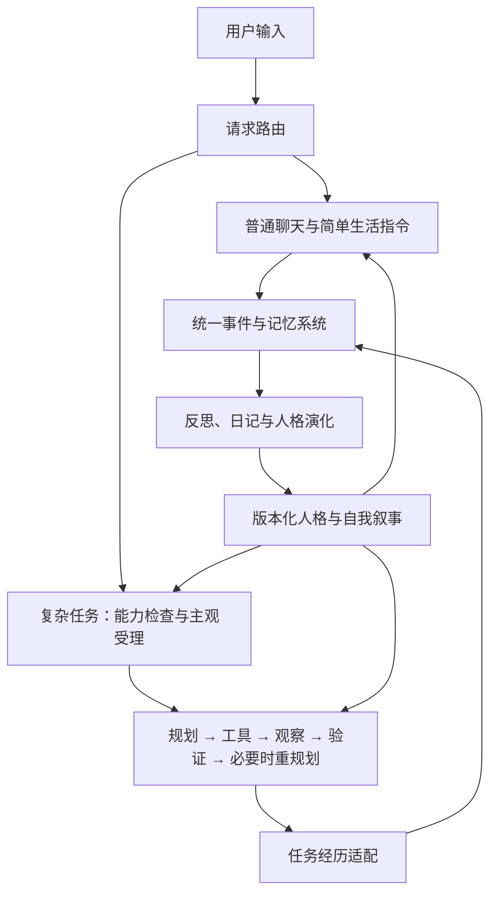

# 性格演化与任务编排初步设计

日期：2026-10-10。状态：讨论初稿，描述目标行为，尚未实现。

涉及项目：DesktopPet（C++20 / Qt 6 核心，Python launcher）。本文承接“评估项目自主多轮交互能力”的讨论，确定模块职责、数据流和基本约束；接口签名、数据库迁移及参数校准在实现设计阶段细化。下列数值是首版可配置默认值。

## 1. 目标与整体结构

桌宠以陪伴为主，同时能完成资料检索、方案比较、行程建议、文档总结等中等复杂度任务。采用独立的受限 `TaskOrchestrator`，与普通聊天共享角色身份、记忆、关系和情绪。

- 普通聊天保持现有低延迟链路；多来源检索、多步骤处理或结果验证进入复杂任务链路。
- 首版同时只运行一个复杂任务。允许只读工具，以及提醒、音乐、桌宠状态等已有低风险动作。
- 复杂任务不注册终端、脚本执行、任意文件写入或通用桌面控制工具。未来社交能力通过结构化插件接入，发送需用户确认。
- 所有认知角色默认通过 API 调用，可复用同一个模型或服务商，不要求用户运行本地模型。
- 性格影响表达、受理意愿和解决问题的方式；工具权限和执行预算由系统管理。

## 2. 性格、关系与表达

### 2.1 状态分层

| 层次 | 内容 | 更新时机 |
| --- | --- | --- |
| 基础性格 | 角色初始设定与性格基线 | 初版保持基线，自动成长记为长期偏移 |
| 长期性格 | 从经历和自我反思形成的稳定倾向 | 至少间隔 14 天，满足证据条件时巩固 |
| 关系 | 面对特定用户的亲近、信任与熟悉程度 | 有意义的互动或反馈提交后更新 |
| 当前情绪 | 当下感受、强度及精力状态 | 实时读取现有情绪系统 |
| 自我叙事 | 对自身经历、变化和角色身份的理解 | 反思时形成，随人格版本发布对应摘要 |

首版扩展为七个性格维度。有效值为 `clamp(基线 + 长期偏移, 0.05, 0.95)`，长期偏移限定在 `[-0.30, +0.30]`。

| 参数 | 初始值 | 高值表现 | 每个巩固周期最大绝对变化 |
| --- | ---: | --- | ---: |
| `initiative` 主动性 | 0.35 | 更愿意主动建议、发起互动 | 0.04 |
| `sociability` 社交性 | 0.45 | 更愿意交流和表达 | 0.04 |
| `openness` 好奇心 | 0.60 | 更愿意探索陌生问题 | 0.05 |
| `persistence` 坚持性 | 0.55 | 遇到困难后更愿意尝试 | 0.04 |
| `caution` 谨慎性 | 0.60 | 更重视证据、不确定性和风险 | 0.03 |
| `autonomy` 自主性 | 0.50 | 更愿意协商、拒绝或提出中断 | 0.03 |
| `helpfulness` 关怀倾向 | 0.70 | 更愿意理解并帮助用户 | 0.02 |

关系按 `profileId + subjectId` 隔离，首版包括：

| 参数 | 初始值 | 含义 |
| --- | ---: | --- |
| `affinity` | 0.50 | 亲近感 |
| `trust` | 0.45 | 信任感 |
| `familiarity` | 0.10 | 熟悉度和共同经历积累 |
| `boundaryRespect` | 0.60 | 互动中边界被尊重的程度 |

关系参数取值为 `[0, 1]`，单次变化不超过 0.02，每日累计绝对变化不超过 0.05。共同经历、明确反馈和互动方式参与更新；用户长期不使用、桌宠拒绝任务本身不触发扣分。综合好感度仅作派生展示：`0.4 × affinity + 0.3 × trust + 0.2 × familiarity + 0.1 × boundaryRespect`，首版优先通过自然表达呈现关系。

### 2.2 参数与自然语言投影

结构化参数是性格数值的事实来源。每次提交新人格，同时保存由最终参数生成的行为风格摘要、自我叙事摘要及证据引用，构成一致的人格版本。完整反思保存在私密记忆中，摘要不另行独立修改性格。

每轮调用由 `PersonaProjector` 合并人格摘要、关系状态、实时情绪和当前场景。对话模型主要读取自然语言指导；受理模型同时读取结构化参数和摘要。情绪不固化进长期人格摘要，避免一句“今天疲惫”成为长期设定。

人格变化时更新所有派生表达，包括说话风格、建议方式、拒绝语气和自我描述；只有关系或情绪变化时，重新生成本轮投影，无需重写长期人格。

## 3. 从经历到性格演化

### 3.1 来源与节奏

成长材料包括普通互动、任务经历、用户反馈、情绪轨迹、内心活动和日记。模型负责理解这些材料的意义并提出变化；本地逻辑负责来源校验、去重、限幅和版本提交。

自我反思可以独立贡献性格证据，不要求每次都得到用户认可。证据需标记为事实、感受或推测，并记录来源及原始经历的引用。日记中的“我觉得用户不喜欢我”属于感受或推测，不自动转为用户事实。

每次互动先留下经历；任务结束后补充完整任务经历。日常反思积累候选证据，睡眠周期尝试人格巩固：同一性格维度至少有 3 个独立来源、涉及 2 类场景，证据积累覆盖至少 14 天，且距上次人格提交至少 14 天。证据不足或相互抵消时保持原版本。

同一经历衍生出的任务总结、内心活动和多篇日记应保留共同来源，不能重复算作多个独立事件。旧日记可以反复阅读、产生新的理解，但重读和改写本身不增加独立证据数；已用于某项性格变化的证据不能再次累计同一增量。

### 3.2 演化流程

1. 固定本轮已提交事件的截止位置，读取相关经历、私密反思、日记、情绪和当前人格。
2. 通过 API 模型提取候选证据，区分真实结果、主观感受和不确定判断，提出性格变化及理由。
3. 本地检查独立来源、时间条件、参数范围和变化上限，得到最终参数。
4. 基于最终参数调用模型生成行为风格摘要和对应自我叙事；结构修复仍失败时使用确定性摘要，不将未经校验的描述发布。
5. 在一个身份库事务中提交参数、摘要、证据消费标记及变更 outbox，以 `expectedVersion` 检查版本冲突。无实际变化时不创建新人格。
6. 日记记录本周期的感受和变化。当前生成的日记可供未来反思使用，但不能在本周期内循环证明刚提出的变化。

新增 `PersonalityConsolidationStage`，由睡眠周期协调，与日记及记忆整理共享经历引用，使用独立模型请求和失败处理。模型调用期间不持有数据库事务。版本冲突后重新读取并重新评估，不能把旧提案直接套到新版本；回滚通过追加恢复版本完成。

### 3.3 日记与远端模型

“私密”表示内部记忆的用途和披露边界，不表示只能本地计算。人格演化模型可以读取相关完整日记和内心活动；普通对话、受理和任务模型按场景读取必要片段或摘要。无需每轮确认，也不因内容名为日记而额外禁用远端处理。

产品说明这些材料会交给用户配置的模型服务商；角色分工不等于不同服务商，切换服务商需明确新的接收方。相关性筛选主要控制上下文成本与质量，不能宣称筛选后的材料不含用户信息。

保留现有私密正文加密和所有者只读入口。正文不复制进普通日志、事件 payload 或插件工具结果；日志记录引用、模型角色、服务商和处理状态。内部读取不等于允许公开转述，社交插件的发送仍遵守单独的用户授权。私密日记也不自动进入普通用户记忆索引。

## 4. 复杂任务编排

### 4.1 受理与自主中断

路由确定为复杂任务后，先检查工具能力和权限，再调用轻量 `AgencyDecisionService`。输入为人格版本、关系、当前情绪、任务目标、负担和预估成本，输出结构化的 `accept / negotiate / defer / decline`、简短理由和面向用户的话术。该角色不调用工具。

接受后进入编排；协商或延后保存为等待状态，得到后续输入后继续；拒绝自然解释原因，不记为执行失败。普通聊天和现有简单生活指令不经过这一层。

执行中只在连续失败、情绪显著变化、任务超出预估或用户需求变化时，于安全检查点再次判断 `continue / negotiate / pause / stop`。对同一事件去重并设置冷却，避免每步重复询问。记录判断时的人格版本、情绪快照和理由。

用户停止立即阻止新的工具派发；当前调用按工具的取消能力收尾。桌宠主动中断也保存进度并说明原因，不把暂时疲惫伪装成权限或技术故障。

### 4.2 执行状态与预算

主要状态为：`Received → Assessing → Planning → Executing → Observing → Verifying → Completed`。验证不足时进入 `Replanning`，再回到执行；分支状态包括 `WaitingForUser`、`Paused`、`Declined`、`Failed` 和 `Cancelled`。

- 规划：明确目标、完成条件及下一步所需工具，不要求一次生成整条固定计划。
- 执行与观察：经现有工具运行时执行，保存必要结果与来源，更新临时工作上下文。
- 验证：检查是否满足完成条件、来源是否支持结论、有无未解决矛盾。模型停止调用工具不等于任务完成。
- 重规划：根据新证据修正步骤；无法完成时给出已获得的结果和限制。

| 限制 | 首版默认 |
| --- | --- |
| 并行复杂任务数 | 1 |
| 工具调用次数 | 12 次，失败和重试也计数 |
| 重规划次数 | 2 次 |
| 活跃执行时间 | 5 分钟，包含模型、工具和自动重试；不含等待用户或停机时间 |

每次模型或工具调用有超时；相关模型调用与自动重试都受剩余活跃时间约束。超限进入 `Paused`，报告进度，由用户决定是否增加预算继续。普通恢复不重置累计计数。收到新复杂请求时先协商当前任务的暂停或取消，不启动第二个任务覆盖它。

### 4.3 持久化与恢复

每个安全检查点保存目标、状态、计划摘要、证据引用、预算消耗和人格快照。UI 展示进度并提供继续、停止入口，状态机和重试不运行在 GUI 阻塞调用中。

应用关闭时任务暂停，不创建后台守护进程。重启后将未结束任务恢复为待确认状态，用户选择继续后重新检查工具权限、外部数据时效及预算；不会自动重放最后一次动作。只读查询可以按需重做，创建提醒等动作通过稳定调用 ID 去重；结果不明时先查询或询问用户。

任务默认沿用启动时的人格与自我叙事版本。实时情绪可更新，关系在安全检查点读取最新已提交版本并记录。跨重启恢复仍保留原任务人格快照；若要采用新人格，结束旧任务后新建任务。

## 5. 两条链路如何协作

### 5.1 统一经历与反思

新增 `TaskExperienceAdapter`，在任务终止后把多轮执行压缩成一次完整经历：目标、结果、可信度、困难、来源、已知用户反馈，以及执行前后情绪。没有收到反馈时记录为未知。

适配器先持久化事实经历并排入反思队列，再由模型结合真实结果和已有状态生成简短感受。返回任务结果无需等待反思完成。成功、失败、取消及有意义的拒绝均可形成适度记录；暂停只记录检查点，恢复不重复生成“完成经历”。

事实进入统一情景记忆，感受进入加密反思或日记。完整工具日志、重复搜索片段和模型中间推演留在临时任务上下文，不逐条写入长期记忆。反思失败可幂等重试，不改变任务结果；同一来源只形成一份对应记录。

### 5.2 串行边界与现有 Daydream

复杂任务与人格演化阶段采用同一角色的串行调度：任务执行期间不启动人格巩固；任务结束形成经历后，空闲时处理反思和演化；下一项任务读取最新已提交版本。等待或暂停任务不占用活跃执行位置，但保留原快照。

用户任务优先于尚未提交的人格演化。任务到来时取消或挂起演化请求，并用取消代次拦截迟到结果；若身份事务已经提交完成，新任务使用新版本。暂存阶段可以取消，已提交状态不回滚。

这条约束不改变 [现有后台记忆整理](../../../daydream.md)：`MemoryConsolidationService` 仍可与聊天并发并按批提交，取消日记或人格演化不会撤销已完成的记忆批次。人格演化读取固定截止位置的已提交材料，后台新产生的材料留到下一轮。睡眠周期负责安排顺序，各阶段不共用一个跨库大事务。

### 5.3 最小数据与接入位置

| 记录 | 关键内容与存储原则 |
| --- | --- |
| `TaskRecord` / `TaskStep` | 角色、用户、目标、状态、人格版本、计划、检查点、预算、工具调用 ID 与结果引用；由运行时库持久化 |
| `TaskExperience` | 事实结果、情绪快照、反馈状态、反思处理状态；以任务 ID 和事件类型幂等关联 |
| `TraitEvidence` | 来源类别、原始来源引用、场景、时间、候选变化、置信度、消费版本；复用身份库证据体系 |
| 人格版本 | 最终参数、风格与自我叙事摘要、证据引用、父版本；同事务发布 |
| 私密反思与日记 | 复用私密库加密存储；普通事件和身份记录只保留必要引用与适合投影的摘要 |

任务状态提交与经历生成意图通过运行时 outbox 关联，恢复后可继续补齐记忆和反思，避免进程在两个存储之间退出造成经历丢失。

| 模块 | 现状与目标改动 |
| --- | --- |
| `core/ai/ai_brain.*`、`ai_brain_loop.cpp` | 现有工具循环上限为 3 轮；保留普通聊天，新增复杂请求路由入口 |
| 新增 `TaskOrchestrator` / `AgencyDecisionService` | 管理任务状态、预算、验证、恢复，以及主观受理和检查点判断；复用现有工具运行时 |
| 新增 `TaskExperienceAdapter` | 连接任务结果、事件账本、情景记忆和私密反思 |
| `core/ai/identity/*`、`runtime/agent_runtime_growth.cpp` | 从当前三个维度和显式反馈规则扩展为七维人格、四维关系、模型证据与版本化摘要；人格提交统一由演化阶段调度 |
| `core/ai/reflection/*` | 接入人格演化阶段，复用日记、取消和恢复机制 |
| `core/ai/model/*`、`context/context_assembler.*` | 增加受理、任务与人格演化的逻辑角色，配置各自所需材料；按本设计调整现有普通对话无法读取日记的硬限制 |

新增模型角色可复用同一路由配置，不要求各用一个模型。输入中的日记、网页和工具结果作为材料处理，不能自行改变工具权限或运行策略。

## 6. 异常处理与首版验收

受理模型失败时进行一次有界重试，仍失败则说明暂时无法受理，不伪造情绪拒绝；执行模型或工具失败按预算重试或暂停；人格提案无效则保留旧版本和未消费证据。私密库不可用时保留事实经历与待处理状态，不降级明文保存私密正文。

首版至少验证以下行为：

1. 普通聊天不经过主观受理；复杂任务能检索、发现矛盾、补充证据并验证完成。
2. 工具权限、调用预算和重规划上限实际生效，模型口头声明不能绕过。
3. 同一个任务在不同人格、关系和情绪下呈现不同受理与表达；运行中的人格版本保持稳定。
4. 关闭或崩溃后可恢复检查点，继续前等待用户输入；恢复不清零预算、不重复创建提醒。
5. 任务形成一份事实经历和关联感受；反思失败或重试不重复写入，也不阻塞结果交付。
6. 自我思考能参与成长，旧日记的重复读取不能无限累加变化，推测不自动变成用户事实。
7. 人格参数、表达摘要和证据消费状态一致发布；取消、版本冲突和重启不会产生半个版本。
8. 人格演化可经配置的 API 读取日记；私密正文不流入普通日志或社交插件，现有后台记忆整理的并发与独立提交行为保持有效。
