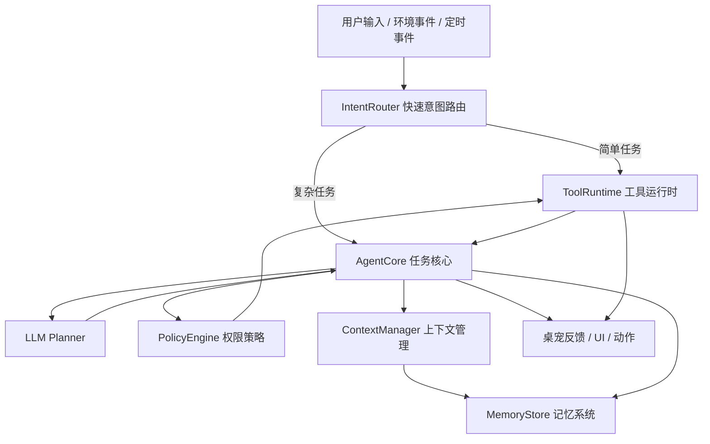
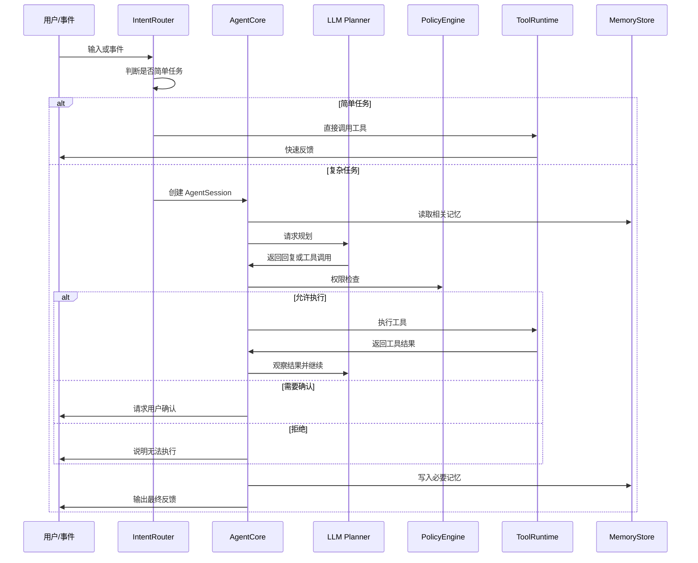

# 桌宠 Agent 架构设计草案

> 目标：将当前桌宠 AI 从“LLM + 少量工具调用”逐步改造成一个安全、快速、可扩展的本地 Agent。

## 1. 当前现状

项目当前已经具备 Agent 的雏形：

- `AIBrain`：负责思考循环、LLM 请求、工具调用循环。
- `LlmChatService`：负责异步请求 OpenAI-compatible LLM。
- `ToolRegistry`：负责注册和分发工具。
- `AITool`：工具抽象基类。
- `ContextBuilder`：构建系统提示词和运行时上下文。

当前主要不足：

- 缺少统一的 Agent 任务状态管理。
- 简单指令也会走 LLM，响应速度不够快。
- 工具权限控制较弱。
- 缺少文件查询、网络查询、Shell、用户确认等基础工具。
- 缺少外部工具接入机制。
- 缺少长期记忆和用户偏好系统。
- 缺少工具结果脱敏、摘要和审计机制。

## 2. 设计目标

桌宠 Agent 应该是：

- 快速的：简单命令不依赖 LLM，直接本地执行。
- 安全的：高风险工具必须经过权限检查和用户确认。
- 可扩展的：支持内置工具，也支持外部工具接入。
- 可观察的：记录工具调用、失败原因、LLM 请求和关键状态。
- 有记忆的：能保存用户偏好、常用习惯和短期对话上下文。
- 桌宠优先的：Agent 能力服务于桌宠体验，而不是无限制电脑控制器。

非目标：

- 不做无限制系统控制。
- 不让 LLM 直接执行 Shell。
- 不默认读取用户隐私目录或敏感文件。
- 不默认将本地私人数据上传给 LLM。

## 3. 总体架构



## 4. 核心模块

### 4.1 AgentCore

目录建议：

```text
core/ai/agent/
    agent_core.h
    agent_core.cpp
    agent_session.h
    agent_session.cpp
    agent_state.h
```

职责：

- 创建和管理一次 Agent 任务。
- 维护任务状态。
- 调用 LLM Planner。
- 接收工具调用请求。
- 将工具调用交给权限策略和工具运行时。
- 根据工具结果决定继续推理、结束、失败或询问用户。

建议状态：

```text
Idle
Understanding
Planning
ExecutingTool
Observing
NeedUserConfirm
Finished
Failed
```

### 4.2 IntentRouter

目录建议：

```text
core/ai/router/
    intent_router.h
    intent_router.cpp
    intent_types.h
```

职责：

- 识别简单、高频、低风险指令。
- 让简单任务绕过 LLM，提高响应速度。
- 判断任务是否需要 LLM、是否需要澄清、是否应该拒绝。

示例：

| 用户输入 | 路由结果 |
|---|---|
| “下一首” | 直接调用音乐工具 |
| “暂停” | 直接调用音乐工具 |
| “几点了” | 直接调用时间工具 |
| “换个动作” | 直接调用动画工具或本地规则 |
| “帮我查一下……” | 进入 AgentCore |
| “帮我整理这个项目的问题” | 进入 AgentCore |

路由结果类型：

```text
DirectReply
DirectToolCall
NeedLLM
NeedClarification
Rejected
```

### 4.3 ToolRuntime

目录建议：

```text
core/ai/tools/runtime/
    tool_runtime.h
    tool_runtime.cpp
    tool_policy.h
    tool_policy.cpp
    tool_result_sanitizer.h
```

职责：

- 包装现有 `ToolRegistry`。
- 在执行工具前进行权限检查。
- 处理工具超时、失败、重试和并发限制。
- 对工具结果做脱敏和摘要。
- 记录工具调用日志。

`ToolRegistry` 继续负责工具注册和查找，`ToolRuntime` 负责“如何安全执行”。

### 4.4 PolicyEngine

职责：

- 给工具分级。
- 判断当前触发来源是否允许调用某工具。
- 判断是否需要用户确认。
- 阻止高风险操作。

建议权限等级：

| 等级 | 类型 | 示例 | 默认策略 |
|---|---|---|---|
| L0 | 只读安全 | 当前时间、桌宠状态、播放状态 | 允许 |
| L1 | 本地查询 | 文件列表、文本搜索、歌单查询 | 限定范围后允许 |
| L2 | 低风险动作 | 播放音乐、切换动画、打开网页 | 可配置 |
| L3 | 高风险动作 | Shell、文件写入、启动程序 | 需要确认 |
| L4 | 危险动作 | 删除文件、修改系统、读取密钥 | 默认禁止 |

关键原则：

- LLM 不能直接执行高风险工具。
- 文件访问必须有根目录限制。
- Shell 命令必须经过确认和审计。
- 私人数据默认不进入 LLM 上下文。

### 4.5 ContextManager

目录建议：

```text
core/ai/context/
    context_manager.h
    context_manager.cpp
    context_builder.h
    context_builder.cpp
    context_budget.h
```

职责：

- 替代或扩展当前 `ContextBuilder`。
- 动态选择要发给 LLM 的上下文。
- 控制上下文长度。
- 注入桌宠状态、任务状态、可用工具摘要和相关记忆。
- 对敏感数据做脱敏。

上下文应按需构建，而不是每次塞入所有信息。

### 4.6 MemoryStore

目录建议：

```text
core/ai/memory/
    memory_store.h
    memory_store.cpp
    memory_types.h
```

记忆类型：

- 短期记忆：当前会话上下文、最近几轮对话。
- 长期偏好：用户喜欢的行为、常用设置、常用音乐偏好等。
- 事件记忆：最近工具调用、失败原因、用户纠正。

初期可使用 JSON 文件存储，后续可迁移到 SQLite。

建议存储位置：

```text
log/ai_memory.json
config/user_preferences.json
```

## 5. 基础工具体系

基础工具分两类：

### 5.1 内置工具

适合实现为 C++ `AITool`：

- 桌宠动画控制。
- 桌宠状态查询。
- 音乐播放控制。
- 当前时间查询。
- 应用配置查询。
- 用户确认请求。
- 简单通知和 UI 反馈。

### 5.2 外部工具

适合通过外部工具协议或子进程接入：

- 文件读取。
- 文件搜索。
- 文本搜索。
- Web Fetch。
- Web Search。
- Shell / PowerShell。
- Git 查询。
- 浏览器自动化。

建议优先探索 MCP 接入，但不要把外部工具直接暴露给 LLM，应通过 `ToolRuntime + PolicyEngine` 统一管控。

## 6. 外部工具接入方案

推荐混合方案：

```text
内置 Tool：桌宠自身能力、低延迟能力
外部 Tool：通用能力，如文件、搜索、Shell、浏览器
```

建议新增：

```text
core/ai/mcp/
    mcp_client.h
    mcp_client.cpp
    mcp_server_process.h
    mcp_server_process.cpp
    mcp_tool_adapter.h
    mcp_tool_adapter.cpp
```

设计思路：


MCP 工具接入后，应被转换为项目内部的 `AITool` 风格：

```text
外部工具 schema -> AITool function schema
外部工具调用 -> ToolRuntime execute
外部工具结果 -> ToolResult
```

## 7. Agent 执行流程



## 8. 响应速度策略

优先级：

1. 本地规则直接处理。
2. 本地工具直接执行。
3. 仅复杂任务进入 LLM。
4. 仅相关工具暴露给 LLM。
5. 工具结果尽量摘要化，避免过长上下文。

示例：

| 任务 | 推荐路径 |
|---|---|
| “下一首” | IntentRouter -> ToolRuntime |
| “现在几点” | IntentRouter -> 本地时间工具 |
| “帮我查一下这个问题” | AgentCore -> Web/Search Tool |
| “帮我分析这个项目” | AgentCore -> 文件搜索/读取/LLM |

## 9. 安全原则

- 默认最小权限。
- 高风险工具默认需要确认。
- Shell 默认禁用或确认后执行。
- 文件访问默认限制在工作区或用户授权目录。
- 禁止读取密钥、token、浏览器凭据等敏感文件。
- 工具调用日志需要脱敏。
- 不将完整私人数据默认发送给 LLM。
- 每次只向 LLM 暴露当前任务相关工具。

## 10. 实施路线

### 阶段 1：Agent 骨架

- 新增 `AgentCore`。
- 新增 `AgentSession`。
- 新增 `IntentRouter`。
- 新增 `ToolRuntime`。
- 新增 `PolicyEngine`。
- 保留现有 `AIBrain`，先作为入口逐步迁移。

### 阶段 2：基础内置工具

优先实现：

- `system_time`
- `user_confirm`
- `file_list_directory`
- `file_read_text`
- `file_search_name`
- `file_search_text`
- `web_fetch_url`
- `shell_execute`（默认需要确认）

### 阶段 3：上下文与记忆

- 扩展 `ContextBuilder` 为 `ContextManager`。
- 增加上下文预算控制。
- 增加短期记忆。
- 增加用户偏好记忆。

### 阶段 4：外部工具接入

- 设计并实现 MCP client 原型。
- 接入一个文件系统类外部工具。
- 接入一个 Shell 类外部工具。
- 所有外部工具必须经过 `PolicyEngine`。

### 阶段 5：主动 Agent 能力

- 增加任务队列。
- 增加主动调度器。
- 支持定时观察状态。
- 支持基于用户偏好的主动建议。

## 11. 推荐下一步

建议优先实现：

1. `ToolRuntime + PolicyEngine`，先把安全边界立住。
2. `IntentRouter`，让简单命令快速响应。
3. `AgentCore`，把复杂任务从 `AIBrain` 中逐步拆出。
4. 再考虑 MCP 和外部工具接入。

这样可以避免一开始就把外部工具、Shell、文件访问全部接进来导致安全边界失控。
